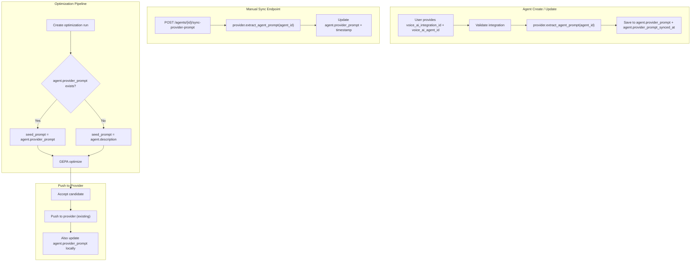

# Provider Prompt Sync -- Implementation Plan

## Problem

The optimization pipeline uses `agent.description` (local metadata) as the seed prompt, but the actual system prompt lives on the voice provider (Vapi, Retell, ElevenLabs). These are conceptually different and can be out of sync. The system never fetches the provider prompt.

## Architecture




## Changes by Layer

### 1. Database: New columns on `agents` table

**File:** [app/models/database.py](app/models/database.py) (Agent class, ~line 218)

Add two columns after `description`:

```python
provider_prompt = Column(Text, nullable=True)
provider_prompt_synced_at = Column(DateTime(timezone=True), nullable=True)
```

### 2. Migration: `016_add_provider_prompt_to_agents.py`

**File:** [app/migrations/016_add_provider_prompt_to_agents.py](app/migrations/016_add_provider_prompt_to_agents.py) (new file)

- `ALTER TABLE agents ADD COLUMN provider_prompt TEXT`
- `ALTER TABLE agents ADD COLUMN provider_prompt_synced_at TIMESTAMPTZ`

### 3. Response Schema: Expose new fields

**File:** [app/models/schemas.py](app/models/schemas.py) (AgentResponse, ~line 264)

Add to `AgentResponse`:

```python
provider_prompt: Optional[str] = None
provider_prompt_synced_at: Optional[datetime] = None
```

### 4. Voice Provider: Add `extract_agent_prompt()` to base and all providers

**File:** [app/services/voice_providers/base.py](app/services/voice_providers/base.py)

Add new abstract method:

```python
@abstractmethod
def extract_agent_prompt(self, agent_id: str) -> Optional[str]:
    """Fetch the current system prompt from the provider."""
    pass
```

**File:** [app/services/voice_providers/vapi.py](app/services/voice_providers/vapi.py)

- **Fix the `get_agent()` stub** (line 170-184): replace the hardcoded `{"agent_id": ..., "name": "Vapi Agent"}` with an actual `GET /assistant/{agent_id}` call (same pattern as `update_agent_prompt` and `retrieve_call_metrics`).
- **Add `extract_agent_prompt()`**: call `get_agent()`, then extract `model.messages` -> find `role=="system"` -> return `content`.

**File:** [app/services/voice_providers/retell.py](app/services/voice_providers/retell.py)

- **Add `extract_agent_prompt()`**: call `get_agent()`, check `response_engine.llm_id` -> if exists, call `self.client.llm.retrieve(llm_id)` to get `general_prompt`. Otherwise, extract `response_engine.system_prompt`. (This mirrors the logic already in `update_agent_prompt` lines 296-310.)

**File:** [app/services/voice_providers/elevenlabs.py](app/services/voice_providers/elevenlabs.py)

- **Add `extract_agent_prompt()`**: call `get_agent()`, then extract `conversation_config.agent.prompt.prompt`.

**File:** [app/services/voice_providers/voicemaker.py](app/services/voice_providers/voicemaker.py)

- Add `extract_agent_prompt()` that raises `NotImplementedError` (consistent with all other methods in this class).

### 5. Helper: Shared prompt sync logic

**File:** [app/services/voice_providers/prompt_sync.py](app/services/voice_providers/prompt_sync.py) (new file)

A small helper function reusable from both the agent routes and the sync endpoint:

```python
def sync_provider_prompt(agent, integration, db) -> Optional[str]:
    """
    Fetch the provider prompt for an agent and persist it.
    Returns the fetched prompt string, or None on failure.
    """
    # 1. Decrypt API key
    # 2. Instantiate provider
    # 3. Call provider.extract_agent_prompt(agent.voice_ai_agent_id)
    # 4. Set agent.provider_prompt + agent.provider_prompt_synced_at
    # 5. Return the prompt
```

### 6. Agent Routes: Auto-sync on create and update

**File:** [app/api/v1/routes/agents.py](app/api/v1/routes/agents.py)

In `create_agent()` (~line 244-261): after creating and committing the `db_agent`, if `voice_ai_integration_id` and `voice_ai_agent_id` are set, call `sync_provider_prompt()`. This should be **best-effort** -- log a warning on failure but do not fail the agent creation. Use a try/except wrapper.

In `update_agent()` (~line 384-394): after applying updates, if the `voice_ai_agent_id` changed (is in `update_data`), call `sync_provider_prompt()`. Same best-effort approach.

### 7. New Endpoint: Manual sync

**File:** [app/api/v1/routes/agents.py](app/api/v1/routes/agents.py)

Add a new route:

```
POST /agents/{agent_id}/sync-provider-prompt
```

- Load agent, validate integration exists and is active.
- Call `sync_provider_prompt()`.
- If it fails, return 502 with the provider error.
- If agent has no voice integration, return 400.
- Return `{ provider_prompt, provider_prompt_synced_at }`.

### 8. Optimization Pipeline: Use provider prompt as seed

**File:** [app/services/optimization/gepa_service.py](app/services/optimization/gepa_service.py) (line 68)

Change:

```python
seed_prompt = agent.description or ""
```

To:

```python
seed_prompt = agent.provider_prompt or agent.description or ""
```

**File:** [app/api/v1/routes/prompt_optimization.py](app/api/v1/routes/prompt_optimization.py) (line 133)

Change:

```python
seed_prompt=agent.description,
```

To:

```python
seed_prompt=agent.provider_prompt or agent.description,
```

### 9. Push Endpoint: Update provider_prompt locally after push

**File:** [app/api/v1/routes/prompt_optimization.py](app/api/v1/routes/prompt_optimization.py) (~line 297-300)

After pushing to the provider, also update the local `provider_prompt`:

```python
candidate.pushed_to_provider_at = datetime.now(timezone.utc)
agent.description = candidate.prompt_text
agent.provider_prompt = candidate.prompt_text        # NEW
agent.provider_prompt_synced_at = datetime.now(timezone.utc)  # NEW
db.commit()
```

### 10. Frontend API Client: New methods

**File:** [frontend/src/lib/api.ts](frontend/src/lib/api.ts) (~line 1507)

Add:

```typescript
async syncProviderPrompt(agentId: string): Promise<{
  provider_prompt: string | null;
  provider_prompt_synced_at: string | null;
}> {
  const response = await this.client.post(`/api/v1/agents/${agentId}/sync-provider-prompt`)
  return response.data
}
```

### 11. Frontend: Show provider prompt in Prompt Optimization UI

**File:** [frontend/src/pages/promptOptimization/PromptOptimization.tsx](frontend/src/pages/promptOptimization/PromptOptimization.tsx)

- Update the `Agent` interface to include `provider_prompt: string | null` and `provider_prompt_synced_at: string | null`.
- In the "New Run" dialog and the seed prompt display, show which prompt source is being used (provider prompt vs local description).
- In the comparison view, label the left column appropriately: "Provider Prompt (Live)" if `provider_prompt` exists, or "Agent Description (Local)" as fallback.
- Optionally, add a "Sync from Provider" button near the seed prompt that calls `syncProviderPrompt()` and invalidates the agents query.

### 12. Frontend: Show provider prompt in Agent Detail

**File:** [frontend/src/pages/agents/AgentDetail.tsx](frontend/src/pages/agents/AgentDetail.tsx)

- Show a "Provider Prompt" section with the synced prompt content and "Last synced" timestamp.
- Add a "Sync Now" button that calls the sync endpoint.
- Visually distinguish between `description` (local metadata) and `provider_prompt` (live production prompt).

## Key Design Decisions

- **Best-effort sync on create/update**: The sync call to the external provider should never block or fail agent creation. If the provider is down or the agent ID is invalid, log a warning and leave `provider_prompt` as null.
- **Fallback chain**: `provider_prompt` -> `description` -> empty string. This ensures backward compatibility for agents created before this feature.
- **Single-column storage**: Store the extracted prompt as a plain `Text` column, not a JSONB structure. The prompt is always a string regardless of provider.
- **No auto-polling**: Prompt sync only happens on create, update, manual sync, or push. No background job that continuously polls providers.

