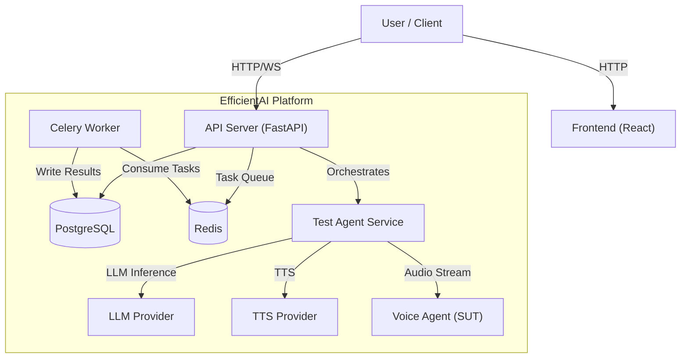

# Architecture

## Simple Overview

EfficientAI is built like a modern web application.

*   **The Brain (API Server)**: Controls everything.
*   **The Worker**: Does the heavy lifting in the background, like processing audio files so the website stays fast.
*   **The Interface (Frontend)**: The website you see and click on.
*   **The Memory (Database)**: Where we store all your agents, test results, and user data.

---

## Technical Deep Dive

EfficientAI is built as a modular, containerized application designed for scalability and extensibility.

*(See original Architecture documentation below)*

## System Components

The platform consists of four primary components:

1.  **API Server (FastAPI)**: The central control plane.
2.  **Worker (Celery)**: Handles asynchronous background tasks (transcription, evaluation).
3.  **Frontend (React/Vite)**: The user interface.
4.  **Data Stores**: PostgreSQL (State) and Redis (Queue/Cache).

## Core Services

### 1. API Server (`app/api`)
Built with FastAPI, it provides REST endpoints for:
*   **Resource Management**: CRUD for Agents, Personas, Scenarios.
*   **Orchestration**: Real-time control of test conversations.
*   **Analysis**: Serving evaluation results and dashboards.

### 2. Asynchronous Workers (`app/workers`)
Powered by Celery and Redis, the workers handle long-running operations:
*   **Transcription**: Processing audio files (using Whisper, Deepgram, etc.).
*   **Evaluation**: Running metric calculations (WER/CER) on completed conversations.

### 3. Test Agent Service (`app/services/test_agent_service.py`)
This is the heart of the testing engine. It:
*   Manages the state of the conversation.
*   Generates accurate system prompts for the Persona.
*   Handles the latency-sensitive loop of: `Listen -> Transcribe -> Think (LLM) -> Speak (TTS)`.
