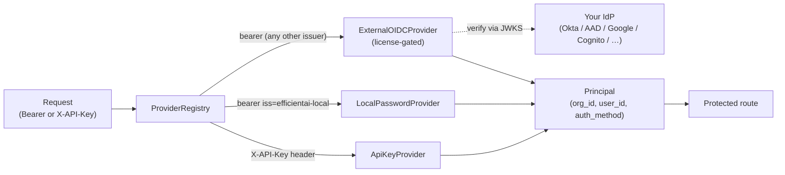

# 🔐 Authentication

EfficientAI ships with a pluggable authentication system that scales from a
single-operator OSS install to an enterprise deployment behind your existing
identity provider. You pick the providers you want in `config.yml` (or via
`AUTH_PROVIDERS` in `.env`) and the API/frontend adapt automatically.

## Deployment models

| Model                     | Providers                     | License needed |
| ------------------------- | ----------------------------- | -------------- |
| OSS self-hosted (default) | `api_key`, `local_password`   | None           |
| Enterprise SSO (BYO IdP)  | `api_key`, `external_oidc`    | `oidc_sso`     |

- **`api_key`** — the `X-API-Key` header, always available, for programmatic
  access (CI pipelines, SDKs, scripts).
- **`local_password`** — email + password, verified against the local users
  table, returns an app-signed HS256 Bearer token. Enabled by default.
- **`external_oidc`** — license-gated. Verifies a Bearer JWT issued by your
  OIDC-compliant IdP (Okta, Azure AD / Entra ID, Google Workspace, AWS
  Cognito, Auth0, Ping, JumpCloud, OneLogin, …) against the issuer's JWKS.

:::info Why no bundled IdP?
In practice every enterprise already runs one. Shipping our own Keycloak
alongside the app just added another thing for you to operate and lock
down. `external_oidc` talks to whatever you already have.
:::

---

## Self-hosted (OSS)

This is the default after `docker compose up -d` or `eai start-all`. No
license, no IdP, no external dependencies.

```yaml title="config.yml"
auth:
  providers:
    - api_key
    - local_password
  local_password:
    # Lifetime of the Bearer tokens minted at sign-in.
    token_ttl_minutes: 720   # 12 hours
    # Let anyone who reaches the login page create an account + new org.
    # Set to false once you've finished bootstrapping.
    allow_signup: true
```

The equivalent environment variables (for Docker Compose / `.env`):

```bash title=".env"
AUTH_PROVIDERS=api_key,local_password
AUTH_LOCAL_TOKEN_TTL_MINUTES=720
AUTH_LOCAL_ALLOW_SIGNUP=true

# HS256 signing key for locally-issued Bearer tokens. Change this in prod!
SECRET_KEY=replace-me-with-a-long-random-string
```

### First-time bootstrap

1. Start the stack.
2. Open `http://localhost:8000/` and click **Create account** on the login
   screen. The first user you create becomes the admin of a fresh
   organization.
3. Mint an API key from **Profile → API Keys** (or via
   `scripts/create_api_key.py`) for programmatic access.

### Password login (email + password)

When `local_password` is enabled, the login screen shows a **Sign in** and
(if `allow_signup: true`) a **Create account** tab. Signing up provisions a
new user and a new organization, and makes that user the `admin` of it. If
you leave the organization name blank, the server derives one from the
email's local-part.

Once signed in, the SPA holds a short-lived Bearer token and silently
re-authenticates before it expires. You can change the token lifetime with
`token_ttl_minutes` — the default is 12 hours.

### Linking a password to an API-key-only account

If you bootstrapped with `scripts/create_api_key.py`, the backend
provisions a placeholder user behind that key (its email ends in
`@efficientai.local`). You can upgrade this identity to a real email +
password login so you can sign in interactively with the same user.

Do it from **Profile → Sign-in Password** while signed in via the API key
— the page detects the placeholder email and prompts you to pick a real
one and a password. After saving, the same user can log in either with
the original API key (for machines) or with email + password (for humans).

Rules the UI enforces:

- If the user already has a password, the form asks for the current one
  before accepting a new one.
- You can only set the email from that screen while it's still the
  placeholder `@efficientai.local` address; "real" users change their
  email from the main profile edit flow.

### Hardening before you expose it to the internet

- Turn off self-service signup once your team is in:

  ```yaml
  auth:
    local_password:
      allow_signup: false
  ```

- Rotate `SECRET_KEY` to invalidate existing sessions.
- Put the app behind a reverse proxy (Nginx, Caddy, Cloudflare) that
  terminates TLS and enforces HSTS.
- Restrict `cors.origins` to the exact domain(s) serving the SPA.

---

## Team management: invitations & organizations

EfficientAI is multi-tenant from the ground up. Every piece of data is
scoped to an **organization**, a user can be a member of more than one
organization, and each membership has a **role** that controls what
they can do.

### Roles

| Role     | Can do                                                     |
| -------- | ---------------------------------------------------------- |
| `reader` | Read-only access to everything in the org.                 |
| `writer` | Everything a reader can + create/update/delete most resources. |
| `admin`  | Everything a writer can + manage users, invitations, roles, API keys, and org settings. |

The role is stored per membership, so the *same user* can be an `admin`
in one org and a `reader` in another.

### Inviting a teammate

Admins invite teammates from **Settings → Team**. An invitation captures
an email and a role and stays valid for 7 days. From the same page,
admins can also:

- See the current members of the org and change their role (with a
  guard so you can't demote the last admin).
- Remove a member from the organization.
- Revoke a pending invitation.

> **Delivery.** The backend creates the invitation record but does **not**
> send email out of the box — plug in your own SMTP / transactional-mail
> provider in front of the invite creation event, or simply share the app
> URL with the invitee and let them discover the invitation on their
> profile page.

### Accepting or declining an invitation

When someone with a pending invitation signs in, their **Profile** page
lists the invitation with **Accept** and **Decline** buttons. Accepting
adds them to the organization with the role the admin chose; declining
clears the invitation.

Accepting does **not** automatically switch the user into the new org —
they stay in their current session until they decide to switch (see the
next section). To make this painless, the profile page shows a green
"Switch to &lt;Org Name&gt;" banner right after a successful acceptance.

### Switching between organizations

EfficientAI uses **scoped tokens**: every Bearer token is pinned to
exactly one organization. To act on behalf of a different org, the user
mints a new token for it — this happens automatically from the UI.

The header's **Organization Switcher** (building icon, top right) lists
every org the user belongs to. Picking one replaces the session token
with a fresh token scoped to that org, and invalidates all in-memory
caches so the dashboard re-fetches with the new scope. The user's role
in the target org can differ from their role in the source org.

API keys can't switch organizations — each key is bound to the org it
was minted in. For programmatic multi-tenant access, create a separate
API key inside each org you need to reach.

:::tip Why scoped tokens instead of an ambient `X-Organization-Id` header?
A single-org token keeps every DB query, rate limiter, and audit log
automatically correct — they only ever see one `organization_id`. An
ambient header would require auditing every query and rewriting the
org-resolution layer everywhere, with a much bigger blast radius if a
check is ever missed. This is also the model Stripe, Linear, and GitHub
use.
:::

---

## Enterprise self-hosted (SSO via your IdP)

For companies that already run Okta, Entra ID, Google Workspace, Cognito,
Auth0, or any other OIDC-compliant identity provider. Humans sign in via
SSO; machines keep using API keys.

### 1. Drop in a license

Request an enterprise license from the EfficientAI team (the JWT must
include the `oidc_sso` feature). Add it to `.env`:

```bash title=".env"
EFFICIENTAI_LICENSE=eyJhbGciOi...
```

Or inline in `config.yml`:

```yaml title="config.yml"
license:
  key: "eyJhbGciOi..."
```

Without the `oidc_sso` feature, the `external_oidc` provider is
advertised by the backend but rejects sign-ins with a pointer to the
missing license feature.

### 2. Register EfficientAI as an app in your IdP

Create a **public OIDC client** (single-page app — no client secret) with:

| Field            | Value                                                 |
| ---------------- | ----------------------------------------------------- |
| Application type | Single-page application (SPA)                         |
| Grant type       | `authorization_code` (+ PKCE if your IdP requires it) |
| Redirect URI     | `https://<your-app>/login/callback`                   |
| Scopes           | `openid profile email`                                |

### 3. Point EfficientAI at the IdP

```yaml title="config.yml"
auth:
  # Drop local_password to force all humans through SSO.
  providers:
    - api_key
    - external_oidc

  oidc:
    issuer: "https://<your-tenant>.okta.com"   # REQUIRED
    audience: "efficientai"                     # expected `aud` claim
    client_id: "0oa..."                         # SPA client id from step 2

    # Default org for new users whose token has no org claim.
    default_org_name: "My Company"

    # Optional. If your IdP emits a custom claim (e.g. a group or tenant
    # attribute), point to it here so a single IdP tenant can route users
    # into different EfficientAI organizations.
    # org_claim_path: ["https://efficientai.com/org"]
```

The backend verifies every incoming Bearer token against the IdP's JWKS,
which it auto-discovers from `<issuer>/.well-known/openid-configuration`.
You never copy public keys by hand.

The same settings as env vars:

```bash title=".env"
AUTH_PROVIDERS=api_key,external_oidc
AUTH_OIDC_ISSUER=https://<your-tenant>.okta.com
AUTH_OIDC_AUDIENCE=efficientai
AUTH_OIDC_CLIENT_ID=0oa...
AUTH_OIDC_DEFAULT_ORG_NAME=My Company
# AUTH_OIDC_ORG_CLAIM_PATH=https://efficientai.com/org
```

### 4. Restart and sign in

```bash
docker compose up -d
```

Open `https://<your-app>/login` — the SSO button appears automatically and
redirects to your IdP.

---

## IdP recipes

The shape of `issuer` / `audience` / `client_id` is always the same. Only
the issuer URL and a few registration clicks differ per IdP.

<details>
<summary><b>Okta</b></summary>

```yaml
auth:
  oidc:
    issuer: "https://<your-tenant>.okta.com"
    audience: "api://efficientai"        # or the Okta API "audience" value
    client_id: "0oa..."                  # SPA application client id
```

*Applications → Create App Integration → OIDC · Single-Page App*, then add
the redirect URI and assign the app to the users/groups that should be
allowed in.

</details>

<details>
<summary><b>Azure AD / Entra ID</b></summary>

```yaml
auth:
  oidc:
    issuer: "https://login.microsoftonline.com/<TENANT_ID>/v2.0"
    audience: "<APP_CLIENT_ID>"
    client_id: "<APP_CLIENT_ID>"
```

*Entra ID → App registrations → New registration → SPA platform*, add the
redirect URI. Under *Token configuration* add the `email` optional claim.
For multi-tenant access, use `organizations` or `common` in the issuer
URL.

</details>

<details>
<summary><b>Google Workspace</b></summary>

```yaml
auth:
  oidc:
    issuer: "https://accounts.google.com"
    audience: "<CLIENT_ID>.apps.googleusercontent.com"
    client_id: "<CLIENT_ID>.apps.googleusercontent.com"
    default_org_name: "Example Inc"
```

*Google Cloud Console → APIs & Services → Credentials → Create OAuth
client ID → Web application*. Restrict the Workspace domain via the
consent screen so only your employees can sign in.

</details>

<details>
<summary><b>AWS Cognito</b></summary>

```yaml
auth:
  oidc:
    issuer: "https://cognito-idp.<REGION>.amazonaws.com/<USER_POOL_ID>"
    audience: "<APP_CLIENT_ID>"
    client_id: "<APP_CLIENT_ID>"
```

Cognito User Pool → *App integration → App client* (public, no secret),
enable the authorization code grant and `openid profile email` scopes, and
register the callback URL.

</details>

<details>
<summary><b>Auth0</b></summary>

```yaml
auth:
  oidc:
    issuer: "https://<your-tenant>.auth0.com/"
    audience: "https://api.efficientai.local"
    client_id: "<APP_CLIENT_ID>"
```

Auth0 *Applications → Single Page Application*. Define the API audience in
*APIs* and reference it here — Auth0 issues access tokens for that
audience which the backend validates.

</details>

---

## How it fits together

Every route depends on a single authentication step. The provider
registry walks each enabled provider in a fixed order and authenticates
the request against the first one whose credential is present:



- **API key** requests are matched on the `X-API-Key` header.
- **Bearer** tokens issued by EfficientAI itself are validated locally
  with `SECRET_KEY`.
- All other Bearer tokens are treated as OIDC and validated against the
  configured IdP's JWKS.

The resulting principal always carries `(organization_id, user_id,
auth_method)`, so every downstream endpoint is multi-tenant and
audit-friendly out of the box.

---

## Troubleshooting

**"No authentication providers are enabled on this deployment."**
Your `auth.providers` list is empty or only names providers the current
license can't unlock. Include at least `api_key` and `local_password`, and
verify `EFFICIENTAI_LICENSE` grants the features you reference.

**SSO tab is missing on the login screen even though `external_oidc` is in
`providers`.**
Either the license doesn't include `oidc_sso`, or `auth.oidc.issuer` is
empty. Check the live config in the backend's `/api/v1/auth/config`
response.

**Users sign in via SSO but keep landing in a fresh org.**
Set `auth.oidc.default_org_name` to your company name, or emit a
deterministic `org` claim from your IdP and map it via
`auth.oidc.org_claim_path`.

**Bearer tokens are rejected with "signature verification failed".**
Make sure the app pod can reach `<issuer>/.well-known/openid-configuration`
and the JWKS endpoint it advertises. Egress proxies commonly block this.

**Signup is disabled.**
`auth.local_password.allow_signup` is set to `false`. Re-enable it
temporarily, or invite the user from **Settings → Team** using an admin
account instead.

**Setting a password from Profile says "This credential is not bound to a
user."**
You authenticated with a legacy API key that has no user attached. Open
your **Profile** page once (the backend lazily provisions a placeholder
user on that call), then retry.

**After accepting an invitation nothing in the UI changes.**
Expected — accepting only adds the membership, it doesn't switch your
session. Click the org switcher in the top bar (or use the green "Switch
to …" banner on the profile page) to mint a token scoped to the new org.

**Org switcher says "API keys are bound to a single organization."**
Switching is only available for interactive (Bearer token) sessions. For
CI pipelines, generate a separate API key inside each organization you
need to reach.
