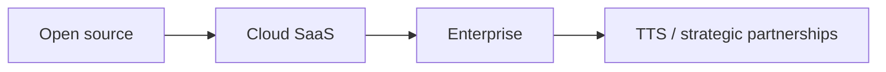

# EfficientAI — Expanded pricing, margins & scale analysis

:::note Internal / planning document

This page captures pricing strategy, margin modeling, and quote-ready baselines (including a Meesho-facing draft). Figures are illustrative unless committed in a signed quote.

:::

---

## 1. Playground bundled with cloud SaaS: strategic decision

### The core question

Should Playground be:

- **A)** Bundled into **$149/mo** (massive value, aggressive adoption)
- **B)** A paid add-on on top of **$149/mo**
- **C)** A reason to raise the base price to **$199–$299/mo**
- **D)** Kept separate for enterprise / TTS providers only

Each option has different implications for the business model and enterprise strategy.

### Understanding Playground costs under BYOK

Under **BYOK**, the customer pays the TTS provider directly. EfficientAI pays mainly for **evaluation compute**, storage, and report generation.

**Illustrative cost stack per Playground session** (example: one text tested against three providers):

- TTS API calls: **$0** (customer API keys)
- Audio storage (e.g. three files ~30s each): **~$0.0003**
- Evaluation compute (per provider, order-of-magnitude): prosody, spectral, pitch dynamics, hallucination check (transcribe + compare), MOS, embeddings — **~$0.02 per provider** in this model
- Three providers: **~$0.06**
- Report generation (PDF): **~$0.01**

**Total (illustrative): ~$0.07 per session**

**At usage levels (same model):**

| Usage | Approx. monthly cost (illustrative) |
|--------|--------------------------------------|
| Light (50 sessions/mo) | ~$3.50 |
| Medium (200 sessions/mo) | ~$14 |
| Heavy (500 sessions/mo) | ~$35 |
| Power (1,000 sessions/mo) | ~$70 |
| Very high (5,000+ sessions/mo) | ~$350 |

### Option A: bundle Playground into $149/mo (recommended positioning)

**Why it can work:**

1. **Value perception** — Head-to-head comparison tooling is often sold separately elsewhere; bundling increases perceived value.
2. **BYOK** — Provider spend sits with the customer; EfficientAI runs evaluation and storage.
3. **Distribution** — Shareable artifacts (e.g. branded PDFs) can drive inbound interest.
4. **Data flywheel** — Aggregate usage can support benchmarks and product improvement (subject to policy).

**Example of what to include at $149/mo (conceptual):**

- Everything in the Cloud tier (e.g. IAM, RBAC, etc.)
- Playground access with fair-use limits, e.g.:
  - Up to **200 playground sessions/month**
  - Compare up to **5 providers** per session
  - Metrics included
  - PDF reports with **EfficientAI branding**
  - **30-day** data retention
- **Not** included (often enterprise): white-label PDFs, blind A/B, historical benchmark library, custom metrics, API access to Playground
- **Overage** (example from model): **$0.15** per additional session beyond 200

### Margin analysis with Playground bundled (illustrative)

Scenario: **$149/mo** with Playground at **200 sessions/month** per customer (illustrative COGS).

| | 10 customers | 50 customers | 200 customers | 1,000 customers |
|---|--:|--:|--:|--:|
| SaaS revenue | $1,490/mo | $7,450/mo | $29,800/mo | $149,000/mo |
| Fixed infra | $315 | $690 | $1,720 | $5,440 |
| Eval compute (core) | $22 | $110 | $440 | $2,200 |
| Playground compute ($14/cust) | $140 | $700 | $2,800 | $14,000 |
| Storage | $0.70 | $3.50 | $14 | $70 |
| **Total COGS** | $477.70 | $1,503.50 | $4,974 | $21,710 |
| **Gross margin** | 67.9% | 79.8% | 83.3% | 85.4% |

**Without Playground (same table structure, illustrative):** gross margin is higher (~9.5pp in this model).

**Verdict (framing):** margins compress when Playground is included, but mid–high 80s gross margin at scale can still be strong if the product accelerates adoption and expansion.

### What if base price is $199/mo?

Illustrative: **$199/mo** with same COGS as above.

| | 10 | 50 | 200 | 1,000 customers |
|---|--:|--:|--:|--:|
| Revenue | $1,990/mo | $9,950/mo | $39,800/mo | $199,000/mo |
| COGS | $477.70 | $1,503.50 | $4,974 | $21,710 |
| **Gross margin** | 76.0% | 84.9% | 87.5% | 89.1% |

Trade-off: higher price recovers margin but can add friction vs **$149** for self-serve adoption.

### Tiered Playground approach (conceptual)

| | Open source | Cloud | Enterprise |
|---|-------------|--------|------------|
| Price | Free | **$149/mo** | Custom |
| | Self-hosted, full eval framework, community | Managed cloud, IAM/RBAC, **Playground Lite**, limits, branded PDFs, email support, retention limits | Everything in Cloud + **Playground Pro**, SSO, SLAs, white-label, API, etc. |

**Why “Playground Lite” in Cloud:** enough to experience value; enterprise upsell for white-label, blind tests, history, API access.

### Does this undermine the TTS provider motion?

**Framing:** self-serve buyers get a **personal comparison and evaluation** workflow; **TTS providers** often buy **distribution, certification, co-marketing, volume benchmarking, and sales-enablement** — a different SKU. More self-serve usage can strengthen category benchmarks without replacing provider partnerships.

---

## 2. Enterprise pricing — breakdown & justification

### Enterprise customer profiles (examples)

1. **Voice AI product company** — high evaluation volume, CI/CD, SSO; rough budget **$25k–$60k/year**.
2. **Enterprise deploying voice AI** — compliance, residency, SLA; **$40k–$100k/year**.
3. **Contact center operator** — real-time quality monitoring; **$50k–$150k/year**.
4. **TTS provider** — competitive intelligence, certification, sales tools; **$50k–$500k/year**.

### Enterprise feature value (qualitative)

| Feature | Indicative vendor cost | Customer value |
|---------|-------------------------|----------------|
| SSO / SAML | $500–$1,000/yr | Often a **procurement gate** |
| SLA | Mostly operational discipline | Downtime risk on eval pipelines |
| Audit logs | $200–$500/yr storage | Compliance programs |
| Data retention | $500–$2,000/yr | Regulated industries |
| Dedicated support | $5k–$15k/yr | Response-time expectations |
| Custom integrations | $2k–$10k one-time | Workflow embedding |
| VPC / dedicated infra | ~$12k/yr | Isolation requirements |
| Playground Pro | $500–$2k/yr compute (variable) | White-label, scale, API |
| Volume evaluations | Variable compute | Production-scale monitoring |
| Custom metrics | $1k–$5k one-time | Vertical-specific scoring |

### Enterprise ROI framing (illustrative)

**Build vs buy (example numbers from the model):**

- Build Year 1 (engineering + infra + maintenance): **~$188.5k** (illustrative)
- Maintain Year 2+: **~$71k/yr**
- EfficientAI **3× $30k ACV** over 3 years = **$90k** → large potential savings vs build (before counting time-to-value).

**Cost of poor quality (illustrative):** incident costs, escalations, and operational drag can exceed annual tooling cost at scale.

### Enterprise tiers (example structure)

| | Enterprise Starter | Enterprise Growth | Enterprise Scale |
|---|-------------------|-------------------|------------------|
| Annual price | **$15,000** | **$30,000** | **$60,000+** |
| Monthly equivalent | ~$1,250 | ~$2,500 | ~$5,000+ |
| Evaluations / year | 50,000 | 200,000 | 1,000,000 |
| Playground | e.g. 500 sessions/mo, branded PDFs | e.g. 2,000 sessions/mo, white-label, blind A/B | Unlimited + API + history |
| Team seats | 10 | 25 | Unlimited |
| SSO / SAML | Yes | Yes | Yes |
| Audit logs | Yes | Yes | Yes |
| Data retention | 6 months | 1 year | Custom (e.g. up to 7 years) |
| SLA | 99.5% | 99.9% | 99.95% |
| Support | Email (e.g. 24h) | Slack (e.g. 4h) | CSM + named engineer |
| VPC / dedicated | No | Optional (+fee) | Included |
| Custom metrics | No | Limited | Unlimited |
| Overage / eval | $0.08 | $0.05 | $0.03 |

*(Exact entitlements should match the live product and contracts.)*

### Enterprise margin snapshots (illustrative)

**Starter ($15k/yr):** Year 1 COGS ~$4,030 → gross margin ~**73%**; Year 2+ COGS ~$3,730 → ~**75%**.

**Growth ($30k/yr):** Year 1 COGS ~$14,480 → ~**52%**; support-heavy; margin improves when support is pooled across accounts.

**Scale ($60k/yr):** Year 1 COGS ~$40,500 → ~**33%**; dedicated infra and white-glove work; margin improves with utilization and shared CSM/engineering across accounts.

### Enterprise sales conversation (outline)

1. **Discovery** — agents in production, monthly eval volume, quality process, compliance, “cost of missing a regression.”
2. **Quantify pain** — manual QA hours, incident frequency, build-vs-buy, audit risk.
3. **Options** — recommend tier with explicit included scope vs build reference.
4. **Objections** — procurement, security review, pilot, annual prepay, land-and-expand.

---

## 3. Scaling examples at each price point (illustrative)

### Months 1–6 (bootstrap)

Example mix: **5× Cloud ($149)** + **1× Enterprise Starter ($15k/yr)**.

- Revenue ~**$1,995/mo** (~$24k ARR)
- COGS illustrative ~**$435/mo** → high gross margin; **real burn** includes team and tools.

### Month ~12 (growth)

Example: Cloud base + overage, multiple enterprise seats, first **TTS provider** deal — revenue mix shifts toward enterprise + strategic accounts.

### Months 12–24 and 24–36

Illustrative P&L at scale: diversified mix (self-serve + enterprise + provider partnerships). **TTS provider** revenue can be high margin and strategic at scale.

---

## Recommendations (summary)

- **Cloud:** **$149** can remain a strong adoption anchor; raise later with data and grandfathering if needed.
- **Enterprise:** land with **Starter** (~**$15k**), expand to **Growth/Scale** as usage and requirements grow.
- **TTS providers:** price on **outcomes** (certification, distribution, benchmarking), not just seats.
- **Portfolio:** balance self-serve velocity, enterprise predictability, and strategic partnerships.

---

## Meesho quote-ready pricing draft

Use as a **finance-facing** baseline; finalize numbers in the official quote.

**Baseline:**

- **Rs 2/min = $0.0217/min**
- **BYOK** (customer-supplied API keys)
- **Overage = base rate:** **$0.0217/min** (no penalty multiplier)

### 1) Cloud SaaS ($149/month)

Recommended **included** limits (aligned to minute math):

- Audio / evaluated minutes included: **6,866 minutes/month** (149 ÷ 0.0217)
- PDF reports: up to **300/month** (within included minutes, if PDFs consume evaluated minutes)
- Playground sessions: **200/month**

**Overage**

- Additional evaluated audio: **$0.0217/min**
- Additional PDF: **no separate PDF fee** if billing is purely minute-based
- Additional Playground: **minute-based** at **$0.0217/min** of evaluated audio

### 2) Product-based approach (Enterprise key)

For teams needing premium support, faster outcomes, dedicated ownership.

**Includes (conceptual):** Playground Pro, prompt optimization support, unlimited support band, dedicated engineer.

**Enterprise key scope (example)**

1. **Playground Pro** — up to **2,000** sessions/mo, white-label reports, historical benchmark access  
2. **Prompt optimization** — up to **20** prompts/mo, up to **5** iterations per prompt, monthly performance review

**Example pricing**

| Term | Price | Breakdown |
|------|------|-----------|
| **1-month key** | **$5,170** | 100,000 min × $0.0217 = **$2,170** usage + **$3,000** engineer/support retainer |
| **3-month key** | **$14,010** (~**$4,670/mo**) | 300,000 min × $0.0217 = **$6,510** + **$7,500** retainer |

### 3) Service-based approach (usage-led)

**Base package**

- **40 hours** included audio = **2,400 minutes**
- Package price: **$52.08** → effective **$0.0217/min**
- BYOK: external API costs are customer-side; if EfficientAI procures keys, pass-through as agreed

**Overage:** **$0.0217/min**; optional rush SLA **+20%**

### 4) TTS benchmark quote format (10-PDF baseline)

- **10 PDFs** included  
- Assumption: **1 PDF = 100 evaluated minutes**  
- Pack: 10 × 100 × $0.0217 = **$217.00** → **$21.70 per PDF**  
- Additional PDF: **$21.70/PDF** at same rate  

If EfficientAI buys third-party keys for the client: pass-through at actuals + **15%** procurement/management fee (line item).

### 5) Finance quote clarity template

Always show:

1. Platform / license fee  
2. Included usage (minutes, PDFs, sessions)  
3. Overage rates  
4. Third-party API pass-through (if any)  
5. Support / SLA  
6. Total monthly and TCV  

### 6) Margin analysis (BYOK, compute-only)

- Revenue per minute = **$0.0217**  
- Internal compute cost per minute = **C**  
- Gross margin per minute = **$0.0217 − C**  
- Gross margin % = **(($0.0217 − C) / $0.0217) × 100**

**Quick reference**

| C ($/min) | Approx INR/min | Margin/min | Gross margin % |
|-----------|----------------|------------|----------------|
| $0.0054 | Rs 0.50 | $0.0163 | 75.1% |
| $0.0109 | Rs 1.00 | $0.0108 | 49.8% |
| $0.0163 | Rs 1.50 | $0.0054 | 24.9% |

**Cloud ($149) at full included usage (6,866 min)**

| C | Total compute COGS | Gross profit on $149 | Gross margin % |
|---|---------------------|------------------------|----------------|
| $0.0054/min | $37.08 | $111.92 | 75.1% |
| $0.0109/min | $74.84 | $74.16 | 49.8% |
| $0.0163/min | $111.92 | $37.08 | 24.9% |

**Service package (2,400 min @ $52.08)**

| C | Total compute COGS | Gross profit | Gross margin % |
|---|---------------------|--------------|----------------|
| $0.0054/min | $12.96 | $39.12 | 75.1% |
| $0.0109/min | $26.16 | $25.92 | 49.8% |
| $0.0163/min | $39.12 | $12.96 | 24.9% |

**Enterprise key:** compute margin follows the same minute math; **dedicated engineer / support retainer** is a separate services margin line.

---

## Visual: economic model (high level)

