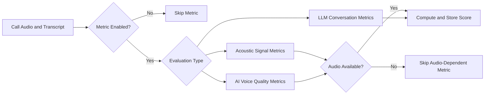

# Metrics

Metrics are the explicit scoring rules used to evaluate each call.

## Metric selection is explicit

Only metrics that are **enabled** for your organization are evaluated.

This means run scoring always reflects your currently enabled metric set, not a hidden global default.

## Metric groups

EfficientAI supports practical metrics across conversation quality, latency, signal quality, and cost.

## Default metric behavior (seeded defaults)

By default:

- `Pitch Variance` starts enabled.
- `Jitter`, `Shimmer`, and `HNR` start disabled.

You can enable or disable metrics from the Metrics page at any time.

## Core platform metrics

These are the default metrics currently seeded for organizations.

### LLM-evaluated conversation metrics

- **Follow Instructions**  
  Measures whether the agent followed the provided behavioral and task instructions.
- **Professionalism**  
  Assesses tone, politeness, and professional behavior throughout the conversation.
- **Problem Resolution**  
  Evaluates whether the user issue was actually resolved.

### Acoustic metrics (signal-based)

- **Pitch Variance**  
  Variation in fundamental frequency (F0); higher values usually indicate more expressive prosody.
- **Jitter (Acoustic)**  
  Cycle-to-cycle pitch period variation; lower is generally more stable.
- **Shimmer**  
  Cycle-to-cycle amplitude variation; lower is generally more consistent.
- **HNR**  
  Harmonics-to-noise ratio; higher usually means cleaner voice quality.

### AI voice quality metrics (model-based)

- **MOS Score**
- **Emotion Category**
- **Emotion Confidence**
- **Valence**
- **Arousal**
- **Speaker Consistency**
- **Prosody Score**

## Extended metric definitions

This section defines the full metric set often used for deeper benchmarking and production tuning.

### A) TTFB (Time To First Byte)

- **Definition**: Time from request sent to first provider response packet.
- **Formula**: `Timestamp(First_Packet_Received) - Timestamp(Request_Sent)`
- **Important caveat**: First packet may only be metadata/headers, not playable audio.
- **Interpretation**: Useful for transport and network overhead, not user-perceived speech start.
- **Example**: A provider can show `~50 ms` TTFB while user still waits much longer to hear speech.

### B) TTFA (Time To First Audio)

- **Definition**: Time from request sent to first playable audio chunk.
- **Formula**: `Timestamp(First_Audio_Chunk) - Timestamp(Request_Sent)`
- **Implementation note**: Binary/audio stream parsing must ignore empty frames and headers.
- **Interpretation**: Primary user-perceived latency metric ("when the user hears voice").

### C) E2E Latency (End-to-End, conversational)

- **Definition**: Time from user finished speaking to agent beginning speech.
- **Formula**: `Timestamp(Agent_Start_Speaking) - Timestamp(User_End_Speaking)`
- **Component breakdown**: `VAD delay + STT time + LLM think time + TTS TTFA + network`
- **Interpretation**: This is the perceived "pause" in turn-taking; large values feel unresponsive.

### D) RTF (Real-Time Factor)

- **Definition**: How fast audio is generated relative to audio duration.
- **Formula**: `Time_To_Generate_Audio / Audio_Duration`
- **Interpretation**:
  - `RTF < 1.0`: faster than real-time (required for robust streaming)
  - `RTF > 1.0`: slower than real-time (higher buffering/stutter risk)

### E) Jitter (Latency Variance)

- **Definition**: Inconsistency of latency across repeated calls.
- **Formula**: `stddev(latency)` over a call sample (for example, 50 calls).
- **Interpretation**: Even with good averages, high jitter creates unpredictable slow turns.

### F) P50 / P95 / P99 Latency

- **Definition**: Latency percentiles that characterize center and tail behavior.
- **Interpretation**:
  - `P50`: median, typical call.
  - `P95`: slow tail affecting 5% of calls.
  - `P99`: extreme tail affecting 1% of calls.
- **Why it matters**: Reliability and SLA risk usually live in P95/P99, not P50.

### G) Flicker Rate (STT, streaming partials)

- **Definition**: How often partial transcripts change before finalization.
- **Formula**: `Number_Of_Changed_Words / Total_Words`
- **Interpretation**: High flicker increases downstream agent instability and premature reactions.

### H) WER (Word Error Rate, STT)

- **Definition**: Transcript error rate against ground truth.
- **Formula**: `(Substitutions + Deletions + Insertions) / Total_Words`
- **Method**: Levenshtein distance alignment.
- **Interpretation**: Lower is better; domain-specific critical terms carry outsized risk.

### I) Instruction Adherence (IA, TTS rendering accuracy)

- **Definition**: Whether generated speech faithfully includes required entities/instructions.
- **Typical workflow**:
  1. Generate audio from constrained prompt (for example, digits/codes).
  2. Transcribe audio.
  3. Check target entity presence and acceptable spoken variants.
- **Interpretation**: Detects pronunciation/entity failures (numbers, acronyms, dates).

### J) Signal Discontinuity ("Pop Count")

- **Definition**: Audible click/pop artifacts at chunk boundaries in synthesized audio.
- **Method**: DSP scan for abrupt amplitude discontinuities at frame/chunk edges.
- **Interpretation**: Higher counts correlate with listener fatigue and lower perceived quality.

### K) CPM (Cost Per Minute)

- **Definition**: Cost normalized to one minute of audio.
- **Example normalization**:
  - Per-character pricing: `(Price_Per_Char * chars_per_second) * 60`
  - Per-token pricing: `Price_Per_Token * tokens_per_minute`
- **Interpretation**: Allows apples-to-apples provider comparison across pricing models.

### L) Shimmer ("Breathiness"/amplitude stability)

- **Definition**: Micro-variation of amplitude cycle-to-cycle.
- **Formula**: Cycle-to-cycle amplitude variation percentage.
- **Interpretation**: Higher shimmer can sound unstable, breathy, or fatiguing over long calls.

### M) Silence Duration ("Pacing")

- **Definition**: Dead-air duration within a single turn (not inter-speaker latency).
- **Method**: VAD-based silence detection across generated audio.
- **Interpretation**: Too much feels awkward; too little feels rushed.

### N) Turn-Taking ("Handshake")

- **Definition**: Coordination delay between one speaker ending and the other starting.
- **Formula**: `Timestamp(Agent_Start) - Timestamp(User_End)`
- **Interpretation**:
  - Small positive values feel natural.
  - Negative values indicate interruptions.
  - Large positive values feel laggy.

### O) Barge-In / Interruptibility

- **Definition**: How quickly the system stops output after user interruption.
- **Formula**: `Timestamp(Bot_Stops) - Timestamp(User_Interrupts)`
- **Interpretation**: Large barge-in latency feels like the agent is ignoring the user.

## Qualitative voice metrics

### A) MOS (Mean Opinion Score)

- **Definition**: Predicted perceptual naturalness/quality score (commonly 1 to 5).
- **Modern automation**: Model-based MOS predictors (for example, NISQA-style approaches).
- **Interpretation**: Fast proxy for human listening quality at scale.

### B) VQM (Voice Quality Metric)

- **Definition**: Signal cleanliness/distortion quality metric.
- **Method**: Spectral distortion/noise analysis.
- **Interpretation**: Lower distortion generally indicates cleaner audio.

### C) HDPR-5 (Human-Desirable Prosody Rating)

- **Definition**: Prosodic human-likeness score (rhythm, pitch variability, pacing).
- **Method**: Aggregate features such as F0 variability and speech-rate variance.
- **Interpretation**: Low values tend to sound monotone/robotic.

### D) Emotional Match Accuracy

- **Definition**: Whether expressed emotion matches intended emotion tag/content.
- **Method**: Compare target emotion with SER model prediction.
- **Interpretation**: Useful for empathetic or role-specific voice behaviors.

### E) Valence and Arousal

- **Definition**: Continuous emotional coordinates instead of discrete labels.
- **Axes**:
  - **Valence**: negative to positive
  - **Arousal**: low energy to high energy
- **Interpretation**: Enables emotion mapping and consistency tracking across voices.

### F) Speaker Consistency

- **Definition**: Identity stability of a voice across utterances.
- **Method**: Compare voice embeddings across samples (often cosine similarity).
- **Interpretation**: Low consistency can feel like voice drift/morphing.

### G) Prosody Score

- **Definition**: How well intonation and rhythm match linguistic intent.
- **Method**: Prosodic contour analysis (for example, question-rise behavior).
- **Interpretation**: Better prosody improves conversational clarity and natural flow.

## Notes on naming

- **Jitter can refer to two different concepts**:
  - **Latency jitter**: variability in response time across calls.
  - **Acoustic jitter**: cycle-to-cycle pitch period instability in the voice signal.

Keep these separated in dashboards and reports to avoid misinterpretation.

## How metrics are applied during processing

1. Call audio and transcript are collected.
2. Enabled metrics are split by evaluation method.
3. Audio-required metrics run only when audio is available.
4. LLM metrics run on transcript and context.
5. Scores are written to evaluator results for reporting and comparison.

If audio is missing, audio-dependent metrics are skipped instead of being fabricated.
