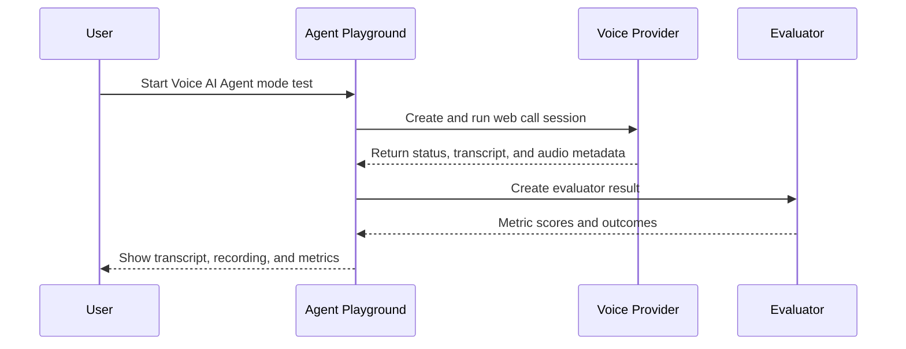
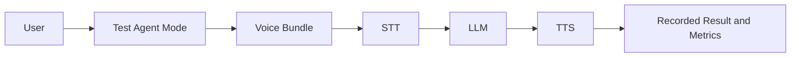

# Playground

The Agent Playground is a real-time environment for quickly testing agents and reviewing outcomes.

## What it does

From one place, you can:

- start live tests,
- monitor call/test status,
- inspect transcripts and recordings,
- observe evaluation progress and metric outcomes.

## Test modes

When an agent is configured, you can run two test modes:

### Voice AI Agent mode

Uses external voice provider configuration and runs a live web call against the provider agent.

Current supported providers:

- Retell
- Vapi
- ElevenLabs

Typical flow:

1. Create web call using selected agent.
2. Connect through provider session/client.
3. Store call recording metadata.
4. Poll provider call details (status, transcript, audio).
5. Create evaluator result and run metric evaluation.

### Test Agent mode

Uses the internal voice-agent path backed by a configured voice bundle.

This is useful for controlled comparisons where you want to test the bundle-defined STT, LLM, and TTS stack.

## Result views

Playground keeps Voice AI Agent and Test Agent runs visible in separate views so teams can inspect each workflow clearly and compare outcomes over time.

## Prerequisites

For external live web-call testing:

- set `call_medium` to `web_call`,
- configure `voice_ai_integration_id`,
- configure `voice_ai_agent_id`.

For richer playback and storage workflows, ensure storage is configured.
