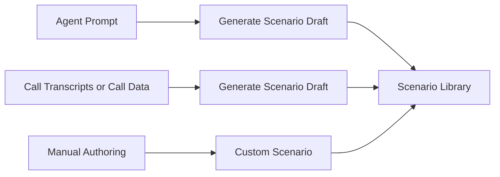

# Scenarios

A Scenario defines the goal and context for a test conversation.

## How scenarios are created

EfficientAI supports three scenario creation paths:

1. **Generate from Agent Prompt (AI-assisted)**  
   Generate scenario drafts from the selected agent's prompt/description.
2. **Generate from Call data**  
   Derive scenario content from call transcripts or call data.
3. **Create Manually**  
   Write a fully custom scenario.

## Scenario structure

| Field | Description |
|---|---|
| `name` | Scenario title. |
| `description` | What should happen in the conversation. |
| `required_info` | Structured key/value expectations for the test. |
| `agent_id` | Optional linked agent for context. |

## How scenarios are used

Scenarios are used to:

- guide persona behavior during tests,
- provide evaluation context for scoring,
- keep testing reproducible across repeated runs.

A good scenario is specific enough to be measurable, but open enough to preserve natural conversation flow.
