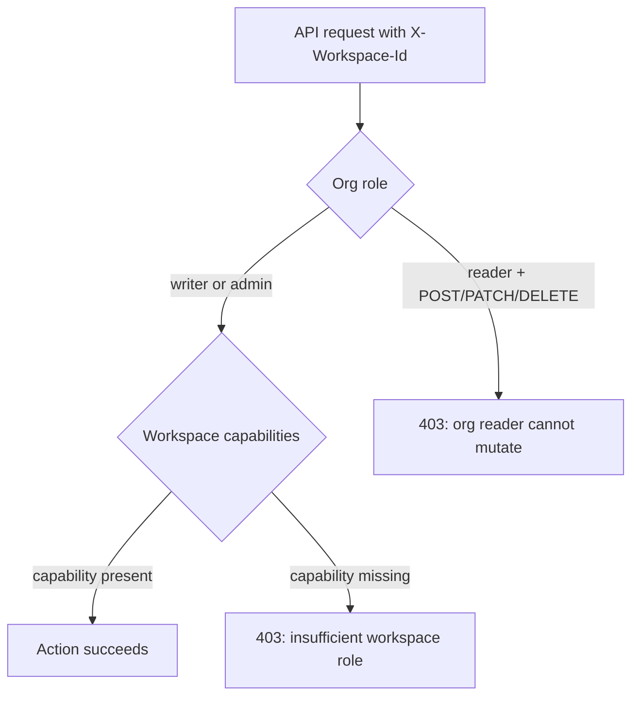

# Workspaces

## Overview

Workspaces provide **in-organization project isolation**. Multiple teams or projects can share one EfficientAI organization while keeping their agents, metrics, call imports, and prompt libraries separate.

Every organization starts with a **Default** workspace. You can create additional workspaces for individual teams, customers, or pilots without provisioning separate orgs.

---

## Workspace switcher

The workspace switcher lives at the top of the left sidebar, directly under the EfficientAI logo.

From the switcher you can:

- See which workspace is currently active
- Switch to another workspace in your organization
- Create a new workspace (display name + slug)

When creating a workspace, you set a display name and optional slug. You are added automatically as **Workspace Admin**; you can optionally invite org members and assign each a workspace role (Viewer, Editor, or Workspace Admin) before saving.

When you switch workspaces, all data views refetch automatically so you never see stale rows from the previous workspace.

---

## How scoping works

The UI stores your active workspace in the browser and sends it on every API request as the `X-Workspace-Id` header. The backend uses this header to scope listings and creates to the selected workspace.

If a request arrives without the header, the backend falls back to the organization's **Default** workspace.

---

## Access control: organization vs workspace

EfficientAI uses **two independent permission layers**. Both apply on every request:

1. **Organization role** — set per membership in **Settings → Team** (`reader`, `writer`, or `admin`).
2. **Workspace role** — set per workspace in **Identity & Access Management → Workspace Members** (`Viewer`, `Editor`, or `Workspace Admin`, plus optional custom roles).

A user must satisfy **both** layers to perform an action. Your organization role controls whether you can write **anywhere** in the org; your workspace role controls what you can do **inside the active workspace**.

### Organization roles

| Role | Scope | Typical use |
| ---- | ----- | ----------- |
| **Reader** | Read-only for the **entire organization** | Auditors, stakeholders who only view dashboards |
| **Writer** | Create, update, and delete most org resources | Engineers and operators doing day-to-day work |
| **Admin** | Everything a writer can do, plus user/team management, API keys, and org settings | Org owners and IT admins |

:::info Org readers are always read-only
If your organization role is **Reader**, every mutating API call (`POST`, `PATCH`, `DELETE`) is blocked — even if you hold **Workspace Admin** in a workspace. Workspace roles cannot override an org-level read-only membership.
:::

Org admins **bypass workspace membership checks** and receive all workspace capabilities in every workspace. API keys also bypass workspace RBAC (they remain org-scoped).

Manage organization roles from **Settings → Team** (admin only). See [Authentication — Team management](/docs/getting-started/authentication#team-management-invitations--organizations).

### Workspace roles (system)

Each workspace has its own membership list. When you are added to a workspace, you receive one of three seeded system roles (or a custom role defined by an org admin):

| Workspace role | Can do | Cannot do |
| -------------- | ------ | --------- |
| **Viewer** | View calls, metrics, evals, simulations, reports, and workspace members | Import, edit, delete, run evaluations, change settings, manage members |
| **Editor** | Everything Viewer can do, plus create/update resources (import calls, manage metrics, run evals, manage simulations, generate reports) | Delete call imports, rename workspace, add/remove members, change workspace roles |
| **Workspace Admin** | Full access in that workspace, including delete, workspace settings, and member management | — |

Roles are **cumulative**: Editor includes all Viewer permissions; Workspace Admin includes all Editor permissions.

### What each role needs for common actions

Use this table when planning access. “Org” = organization role; “Workspace” = role in the **active** workspace (from the switcher).

| Action | Minimum org role | Minimum workspace role |
| ------ | ---------------- | ---------------------- |
| View call imports, agents, metrics | Reader | Viewer |
| Upload / import calls, edit rows | Writer | Editor |
| Delete call imports or batches | Writer | **Workspace Admin** |
| Create or edit metrics (workspace-scoped) | Writer | Editor |
| Run evaluations | Writer | Editor |
| Rename a workspace | Writer | **Workspace Admin** |
| Add/remove workspace members | Writer | **Workspace Admin** |
| Create a new workspace | Writer | *(creator becomes Workspace Admin automatically)* |
| Delete a workspace | Admin | *(org admin only)* |
| Manage organization users & invitations | Admin | *(not workspace-scoped)* |

When a workspace check fails, the API returns a plain-language message such as *“This action requires at least the Editor role in the active workspace. Your current workspace role is Viewer.”* Delete operations require **Workspace Admin**, not Editor.

### Capability domains (reference)

Workspace permissions are implemented as **capabilities** grouped by product area. System roles are bundles of these capabilities; org admins can also define **custom workspace roles** in **IAM → Workspace Roles** by picking capabilities from this registry.

| Domain | View | Create / edit / run | Delete / admin |
| ------ | ---- | ------------------- | -------------- |
| **Calls** (call imports) | View batches and rows | Import and update | Delete imports |
| **Metrics** | View definitions | Manage metrics | — |
| **Evaluations** | View runs and results | Run evaluations | — |
| **Simulation** | View agents, personas, scenarios | Manage simulation resources | — |
| **Reports** | View reports | Generate reports | — |
| **Workspace** | View member list | — | Rename workspace; add/remove members and roles |

Custom roles are useful when a user needs a narrow slice of access (for example, view + run evals but not import calls). Assign them per workspace from **IAM → Workspace Members**.

### Default access for new members

When workspace RBAC is enabled or a new workspace is created:

- New workspaces: the **creator** is added as **Workspace Admin**.
- Existing org members may be backfilled into workspaces with roles mapped from their org role: org admin → Workspace Admin, writer → Editor, reader → Viewer.

Org admins should review **IAM → Workspace Members** after creating workspaces and remove or downgrade memberships that are too broad for your team model.

### Managing workspace access

1. Open **Identity & Access Management** in the sidebar.
2. Go to **Workspace Members**, select a workspace, and assign roles to org members.
3. Org admins can define custom roles under **Workspace Roles**.

The workspace dropdown shows your current role in the selected workspace (for example, **Viewer**). Use the members table to review who has access and change roles — if you hold **Workspace Admin** in that workspace and are an org Writer or Admin.

Notes:

- You can only manage members in a workspace if you are an **org Writer or Admin** **and** hold **Workspace Admin** (or org admin) in that workspace.
- **Workspace Admins cannot demote their own role**; another admin must change it.
- Users with org **Reader** can see member lists where allowed but cannot change memberships.

---

## What is workspace-scoped

Workspaces isolate the resources you interact with day to day, including:

| Category | Resources |
|----------|-----------|
| Simulation | Agents, Personas, Scenarios, Evaluators |
| Evaluation | Evaluator results, legacy evaluations |
| Metrics | Custom and built-in metrics (when created with workspace scope) |
| Call imports | Call import batches and evaluations |
| Prompt tooling | Prompt partials, prompt optimization runs |
| Voice playground | Comparisons, samples, blind-test shares |
| Judge alignment | Judge datasets and runs |

Switching workspace changes which rows appear in each of these sections.

---

## Organization-wide resources

Some metrics can be created with **organization** scope instead of workspace scope. Organization-scoped metrics:

- Are stored with `workspace_id = null`
- Appear in **every** workspace in the org
- Are useful for shared rubrics, compliance checks, or standard evaluation criteria

When creating a metric or categorization label group, choose **Organization** visibility if the rubric should be shared; choose **Workspace** (the default) to keep it project-specific.

See [Metrics](/docs/products/metrics) for details on scope and categorization.

---

## Default workspace rules

- Every organization has exactly one Default workspace (created automatically).
- The Default workspace **cannot be deleted**.
- If your stored workspace ID is invalid (for example after an org switch), the UI resets to Default.

---

## Recommended usage

- **One workspace per team or project** — e.g., `support_pilot`, `sales_eval`, `customer_acme`.
- **Keep shared rubrics org-wide** — compliance metrics or standard QA scorecards that every team uses.
- **Switch before creating resources** — agents, metrics, and prompt partials are created in the active workspace.

---

## API

Workspace management endpoints live under `/api/v1/workspaces`:

- `GET /workspaces` — list workspaces you can access (includes your role name and capabilities per workspace)
- `POST /workspaces` — create a workspace (name, optional slug); requires org **writer** or **admin**
- `PATCH /workspaces/{id}` — rename a workspace; requires **Workspace Admin** in that workspace
- `DELETE /workspaces/{id}` — delete a non-default workspace; requires org **admin**

Workspace membership and roles:

- `GET /workspaces/{id}/members` — list members (requires `workspace.members.view`)
- `POST/PATCH/DELETE …/members` — manage membership (requires `workspace.members.manage`)
- `GET /workspace-roles` — list org workspace roles (for IAM UI)
- `GET /capabilities` — capability registry for custom role builder (authenticated)

All other scoped API calls should include `X-Workspace-Id` with the target workspace UUID. Routes enforce the minimum workspace capability for the HTTP method (view vs create/update vs delete). See [Access control](#access-control-organization-vs-workspace) above for how this maps to Viewer / Editor / Workspace Admin.
