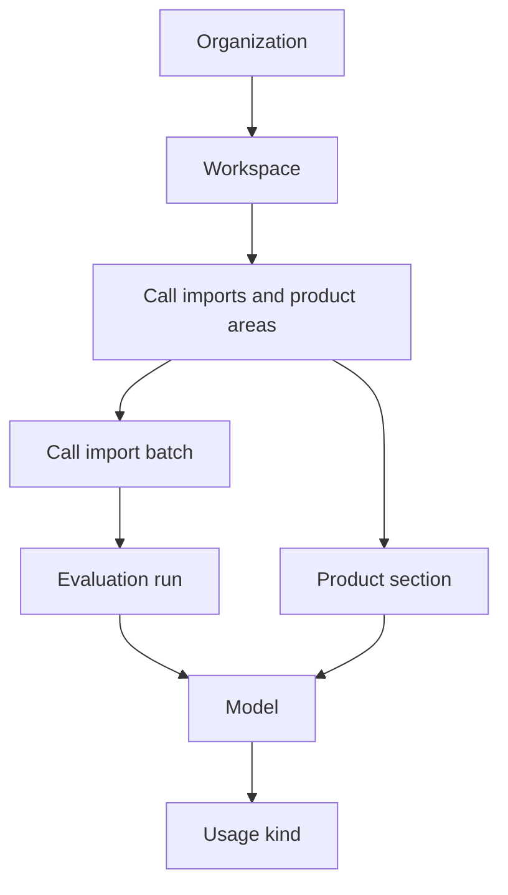

# Usage

**Usage** is org-scoped analytics for LLM, STT, and TTS consumption with estimated costs. It helps you see how much each workspace, product area, call import, and model is consuming — and what that usage likely costs.

Usage is **not** a quota or billing portal. Optional Flexprice event metering is a separate system and is not shown in the Usage UI.

Models and providers tracked here come from your enabled [integrations](/docs/getting-started/integrations/). Usage is attributed per [workspace](/docs/getting-started/workspaces/) when the underlying workflow is workspace-scoped.

---

## Opening the Usage page

In the sidebar, go to **Usage → Overview** (`/usage`).

The page has two tabs when your org is licensed for enterprise features and you are an org admin:

| Tab | URL | Who can access |
|-----|-----|----------------|
| **Overview** | `/usage` | All org members |
| **Pricing overrides** | `/usage?tab=pricing` | Org admins with enterprise license |

---

## Summary metrics

The top of the Overview tab shows rollup cards for the selected date range and filters:

| Metric | Description |
|--------|-------------|
| **Input tokens** | Prompt or input tokens sent to LLM providers |
| **Output tokens** | Completion or output tokens returned by LLMs |
| **Total tokens** | Sum of input and output tokens |
| **LLM calls** | Number of LLM API calls |
| **STT audio** | Speech-to-text audio duration (shown when non-zero) |
| **TTS characters** | Text-to-speech characters synthesized (shown when non-zero) |
| **Cache read** | Tokens read from provider prompt cache (shown when non-zero) |
| **Cache write** | Tokens written to provider prompt cache (shown when non-zero) |
| **Reasoning** | Reasoning tokens billed separately by some providers (shown when non-zero) |
| **Estimated cost** | Total estimated cost for the filtered range |

Click **Cost breakdown** to open a modal with line items:

- Input, output, cache read, cache write, reasoning
- Audio (STT), TTS
- Total estimated cost

If any usage in the range has no matching catalog rate, the breakdown shows an **unpriced usage** warning. Those rows still appear in token/volume metrics but do not contribute to cost totals.

### Currency display

Toggle between **USD** and **INR** in the filter bar. INR amounts use a live USD→INR rate from Frankfurter when available, with a fallback estimate when the FX service is unreachable.

---

## Filters

Filters narrow the summary cards and drill-down table. All filter state is stored in the URL, so you can bookmark or share a specific view.

| Filter | Description |
|--------|-------------|
| **Date range** | Start and end dates, interpreted in your browser's IANA timezone |
| **Workspace** | Limit to one workspace |
| **Call import** | Limit to one call import batch |
| **Dataset** | Filter by dataset name on call import rows |
| **Tag** | Filter by call import tag |
| **Evaluation run** | Filter by evaluation resource |
| **Usage kind** | `LLM`, `STT`, or `TTS` |
| **Model** | Provider model identifier |
| **Source / product section** | Product area (playground, evaluators, call imports, etc.) |

---

## Drill-down navigation

Click rows in the breakdown table to drill deeper. Breadcrumbs at the top show your current path; click a breadcrumb to go back up.

At the organization level, the table groups by **workspace**. Inside a workspace you see a composite view:

- **Call import batches** — CSV uploads or manual audio recordings
- **Product areas** — usage from other parts of the platform (not tied to a single call import)

From a call import batch you can drill into evaluation runs, then model, then usage kind. From a product area you drill into model, then usage kind.

Each drill level returns at most **100 rows**. If more exist, results are truncated at that level.

### Product sections

| Section | What it tracks |
|---------|----------------|
| **Call imports** | Call import batch processing |
| **Call import evaluations** | Evaluations run on imported calls |
| **Playground** | Text playground and experiments |
| **Voice playground** | Voice agent playground — LLM, STT, and TTS |
| **Chat** | Chat conversations |
| **Telephony** | Telephony and live calls |
| **Evaluators** | Evaluator definitions and runs |
| **Metrics** | Metrics and scoring |
| **Judge alignment** | Judge alignment workflows |
| **Prompt optimization** | Prompt optimization jobs |
| **Personas** | Persona generation |
| **Agents** | Agent configuration |
| **Prompt partials** | Prompt partials |
| **Conversation evaluations** | Conversation evaluations |
| **Test agent** | Test agent sessions |
| **Other** | Usage not attributed to a named product area |

---

## Data freshness and history

### Freshness

Usage counters are buffered in Redis and flushed to Postgres by the `worker-usage` service on a Celery Beat schedule (default: every **2 minutes**). The UI reads Postgres only.

The page shows **Updated** with a `last_updated_at` timestamp when available. Expect roughly **2 minutes** of lag between new API usage and what appears on this page.

For fresh data in self-hosted deployments, ensure `beat`, `worker-usage`, and the default `worker` are running (or use `eai start-all`).

### History limits

| Deployment | History window | Pricing overrides tab |
|------------|----------------|----------------------|
| **OSS** (no license) | Last **7 days** | Hidden |
| **Enterprise** (`EFFICIENTAI_LICENSE`) | Unlimited | Org admins only |

On OSS deployments, an amber banner explains the 7-day cap and points to `EFFICIENTAI_LICENSE`. If you pick a wider date range, it is automatically clamped to the allowed window.

See [Configuration](/docs/reference/configuration/) for license setup.

---

## Pricing overrides

Enterprise org admins can open **Pricing overrides** (`/usage?tab=pricing`) to set per-model rates that override the built-in catalog for cost estimation.

### Override fields by usage kind

| Usage kind | Rate fields (USD) |
|------------|-------------------|
| **LLM** | Input / 1M tokens, output / 1M tokens, cache read / 1M, cache write / 1M, reasoning / 1M, audio / minute |
| **STT** | Audio / minute |
| **TTS** | Characters / 1M |

For each override you set:

- **Provider credential** — models come from enabled integrations
- **Usage kind** — LLM, STT, or TTS
- **Model** — provider model identifier
- **Effective from** — date the override starts applying
- **Rates** — USD values for the fields above

You can prefill rates from the catalog or an existing override. Saving creates or updates the override; deleting removes it.

### How overrides affect costs

Overrides apply to **new usage** recorded on or after `effective_from`. Costs already stamped on daily rollup rows are **not** changed automatically.

To backfill historical costs after a catalog or override change, use the CLI or API recompute workflow. The Usage UI does not expose recompute jobs today — see [CLI Commands](/docs/reference/cli-commands/#usage-pricing).

---

## Operations

Self-hosted operators manage pricing catalogs and cost backfills outside the UI.

| Requirement | Purpose |
|-------------|---------|
| `beat` | Schedules usage flush, FX refresh, OSS history prune |
| `worker-usage` | Flushes Redis counters and runs cost recompute jobs |
| Default `worker` | Evaluator cron dispatch (indirectly drives much platform usage) |

Common tuning variables (see `env.example`):

| Variable | Default | Purpose |
|----------|---------|---------|
| `USAGE_FLUSH_BEAT_SECONDS` | `120` | Flush interval (~2 min UI lag) |
| `USAGE_READ_CACHE_TTL_SECONDS` | `90` | Redis cache TTL for summary/breakdown/filters |
| `USAGE_FLUSH_MAX_BATCHES_PER_RUN` | `30` | Batches per flush tick |

For seeding rates, diffing catalogs, and recomputing stored costs, see [CLI Commands — Usage pricing](/docs/reference/cli-commands/#usage-pricing).
