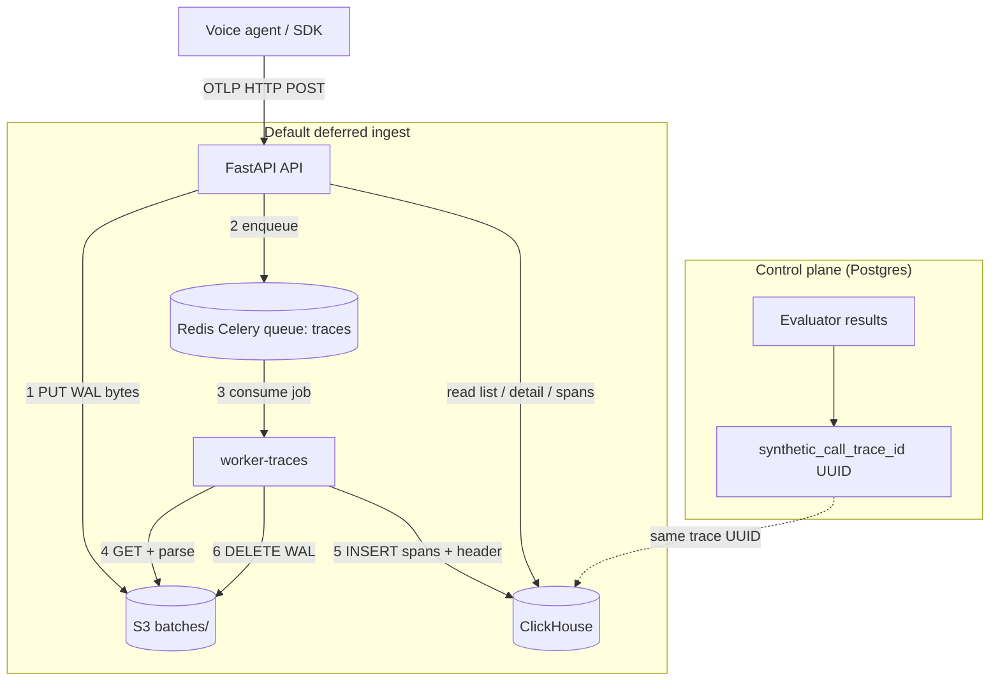
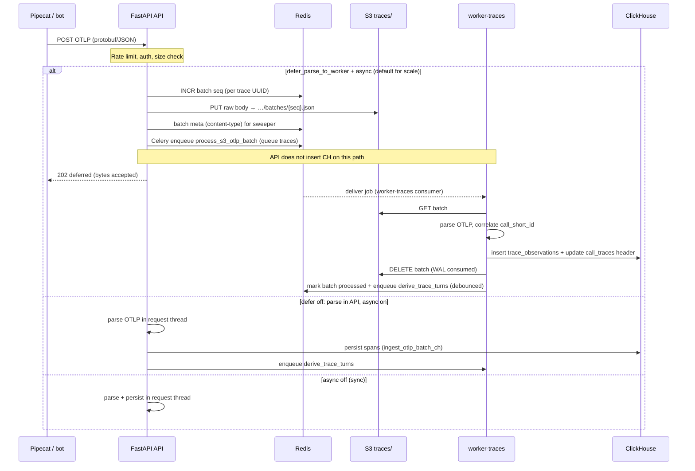

> **Doc role:** Scaling deep-dive under [Voice Call Traces & Observability (Index)](https://efficientai.atlassian.net/wiki/spaces/ETD/pages/69959682).
>
> **Paste target (Confluence):** Page title **TDD: Call Traces — Scaling Architecture & Bottleneck Analysis** (update in place; Mermaid blocks render if the space has the Mermaid macro).

# TDD: Call Traces — Scaling Architecture & Bottleneck Analysis

**Version:** 2.0  
**Date:** September 2026  
**Repo:** efficientAI  
**Branch / ship status:** `otel-traces` — **not in production yet** (local/staging until release + deploy checklist in §8)  
**Audience:** Platform engineers, DevOps/SRE, architects, solutions (capacity)  
**Companion docs:** [Main Call Traces TDD](https://efficientai.atlassian.net/wiki/spaces/ETD/pages/68616193) · [Latency Metrics](https://efficientai.atlassian.net/wiki/spaces/ETD/pages/71434241) · [Call Import Scaling](https://efficientai.atlassian.net/wiki/spaces/ETD/pages/59899905) · In-repo: `docs/otel-traces-team-sync.md` (team sync E2E) · `docs/call-traces-storage-decision-tdd-confluence.md`

**Purpose:** End-to-end architecture for OTLP call traces (what runs in prod), scaling limits per service, bottleneck order as load grows, and phased options (collector, CH cluster). DevOps should be able to size **API, worker-traces, Redis, S3, ClickHouse, Postgres (control plane only)** from this doc.

---

## 0. Executive summary

EfficientAI ingests **OpenTelemetry spans** from voice agents during **live** calls (Pipecat, LiveKit, custom OTLP). Unlike batch call import, trace ingest is **continuous** (~one HTTP POST per export interval, often **5s**), **latency-sensitive** for the live Calls UI, and **multi-minute per session**.

**Production architecture (target on `otel-traces`):**

| Layer | Technology | Role |
| --- | --- | --- |
| HTTP edge | **FastAPI API** | Auth, rate limits, OTLP accept, trace **read** APIs, session open/close |
| WAL buffer | **S3** (`traces/…/batches/{seq}.json`) | Durable staging between API accept and worker parse (**seconds**, deleted after success) |
| Job queue | **Redis** + **Celery** queue **`traces`** | Deliver `process_s3_otlp_batch`, derive, close, sweeps |
| Span store | **ClickHouse** | `call_traces` headers, `trace_observations` spans, list/waterfall queries |
| Control plane | **Postgres** | Orgs, workspaces, API keys, `evaluator_results.synthetic_call_trace_id` (UUID link only — **not** span payloads at scale) |
| Live UI cache | **Redis** | Live turns TTL, batch seq, debounce keys, ingest rate limits |
| Archive | **S3** (`…/spans.json` on close) | Long-term compact span archive; optional analytics export |

**Mandatory for default ingest:** `clickhouse.url` + `traces.defer_parse_to_worker` + `traces.async_ingest_enabled` + **`worker-traces`** consumer (Docker service or `[WORKER-TRACES]` from `eai start-all`). After PG migration **092**, there is **no** PG fallback for span bodies.

**Capacity (order of magnitude):**

| Era | Comfortable concurrent OTLP calls | Primary bottleneck |
| --- | --- | --- |
| Phase 1 (sync PG JSONB) | 10–20 | API CPU + Postgres row locks |
| **Phase 2 (S3 WAL + CH) — now** | **100–500+** (scale workers + CH) | **`worker-traces` queue depth**, **ClickHouse insert rate**, derive CPU |
| Phase 3 (OTel Collector + gRPC) | 2,000–10,000+ ingest | CH merge/derive, S3 PUT fan-in, collector ops |
| Phase 4 (CH cluster, retention tiers) | 10,000+ concurrent | Cross-tenant query cost, retention $ |

**Key insight:** Faster ingress (collector, gRPC) **moves** pressure to **ClickHouse writes**, **derive jobs**, and **list/query** — not “solved forever.” Size each tier independently.

---

## 1. End-to-end architecture (DevOps view)

### 1.1 Two planes

| Plane | Stores | What |
| --- | --- | --- |
| **Control** | Postgres | Evaluator results, call recordings metadata, org/workspace, opaque `synthetic_call_trace_id` |
| **Data** | ClickHouse + S3 | Span observations, trace headers for list/detail, WAL batches, `spans.json` archive |

Bots speak **HTTP only to the API**. They never call `worker-traces` (no public OTLP port on workers).

### 1.2 HTTP accept vs “ingest complete”

On the **recommended** path (`defer_parse_to_worker: true`, `async_ingest_enabled: true`):

| Step | Component | What happens |
| --- | --- | --- |
| Accept | **API** | Auth, rate limit, size check |
| Buffer | **API → S3** | PUT raw OTLP bytes → `…/batches/{seq}.json` (**WAL only** — not in CH yet) |
| Schedule | **API → Redis** | Celery `process_s3_otlp_batch` on queue **`traces`** |
| Respond | **API → bot** | **202** deferred |
| Complete | **`worker-traces`** | GET S3 → parse OTLP → **INSERT ClickHouse** → DELETE S3 batch → debounced **derive** |

**Misread to avoid:** API → S3 is **not** “spans stored.” CH inserts for deferred OTLP happen **only in worker-traces** (unless defer is off — see matrix §1.4).

The API **does** query ClickHouse for **reads** (list, detail, spans) and may write CH directly only on **non-defer** ingest modes.



**Ingest order:** Bot → API → S3 (buffer) → Redis (job) → worker-traces → ClickHouse.

### 1.3 Ingest sequence (default path)



### 1.4 Ingest path matrix (`config.yml` → `traces.*`)

| `defer_parse_to_worker` | `async_ingest_enabled` | `clickhouse.url` | Behavior |
| --- | --- | --- | --- |
| **true** (recommended) | **true** | **required** | API → S3 → enqueue → worker → CH. **202** to bot. |
| false | true | set | API parses, writes CH in API process, enqueues derive on worker. |
| * | false | CH required post-092 | Sync parse + persist in API request (higher p95 latency). |

\*After migration **092**, PG span tables are dropped; **CH is required** for traces.

**Non-default helpers:** staged ingest (`process_staged_otlp`); **orphan sweeper** `sweep_orphan_s3_batches` if Celery enqueue failed after S3 PUT.

### 1.5 Services inventory (what to deploy)

| Service | Image / process | Ports / exposure | Must scale? |
| --- | --- | --- | --- |
| **API** | `eai start` / app container | Public HTTP (LB) | Yes (stateless) |
| **worker-traces** | `eai worker … -Q traces` | None (internal) | **Yes** — default ingest blocked without it |
| **beat** | Celery beat | Internal | **Single replica** only |
| **Redis** | redis:7 | Internal | HA for prod; broker + cache |
| **ClickHouse** | clickhouse server | Internal 8123/9000 | Vertical + replicas/cluster at scale |
| **Postgres** | db | Internal | Control plane; not span IOPS |
| **S3 / R2** | Managed object store | HTTPS | Unlimited; watch PUT rate per prefix |

**Do not** run two consumers on the same `traces` queue without intending to scale horizontally (N workers = OK; duplicate beat = bad).

### 1.6 Runtime topologies

| Environment | Traces worker | Infra |
| --- | --- | --- |
| **Local dev** | `[WORKER-TRACES]` subprocess from **`eai start-all`** (always on) | `docker compose up -d db redis clickhouse` + host `start-all` |
| **Docker Compose full stack** | Service **`worker-traces`**; API uses **`eai start`** only (no embedded traces worker) | `app` + `worker-traces` + `beat` + CH + Redis + PG |
| **Kubernetes / prod** | HPA on **`worker-traces`** replicas | Same Redis broker, S3, CH as API; shared `config.yml` / secrets |

`start-all` sets **`EFFICIENTAI_CONFIG_PATH`** so worker children load the same config as `--config`.

### 1.7 Component failure modes (SRE)

| Component | If down / misconfigured | Symptom |
| --- | --- | --- |
| **API** | — | No ingest, no UI API |
| **worker-traces** | Not running | **202** accepted but **empty CH**; S3 `batches/` backlog |
| **ClickHouse** | Unreachable | Readiness **503**; ingest **503**; trace UI empty |
| **S3** | Disabled / auth error | Deferred ingest fails at PUT |
| **Redis** | Down | Enqueue fails; batch seq fails; Celery stalled |
| **Postgres** | Down | App auth / evaluators broken; trace **reads** still CH if API up |
| **beat** | Off | Idle close + orphan sweep delayed (manual close still works) |

### 1.8 Celery tasks (queue `traces`)

| Task | Purpose |
| --- | --- |
| `process_s3_otlp_batch` | WAL → parse → CH insert → delete S3 (retries if 0 rows persisted) |
| `derive_trace_turns` | Turns, latency percentiles, aggregates (debounced ~3s) |
| `close_and_offload_trace` | Close session, metrics, optional `spans.json` to S3 |
| `sweep_idle_traces` | Auto-close after `idle_close_seconds` |
| `sweep_orphan_s3_batches` | Re-drive batches missing worker jobs |
| `process_staged_otlp` | Alternate staging path if enabled |

### 1.9 S3 object lifetimes

| Key pattern | Lifetime | Purpose |
| --- | --- | --- |
| `…/traces/{uuid}/batches/{seq}.json` | Seconds (while worker lags) | OTLP WAL |
| `…/traces/{uuid}/spans.json` | Long-term | Archive on close |

**Healthy bucket:** often **no visible `batches/`** during a call; after hangup **`spans.json`** under trace prefix.

### 1.10 Read path (Calls / Traces UI)

- **List / detail / spans:** ClickHouse via API (`GET /api/v1/observability/traces…`).
- **Open calls — live turns:** Redis overlay on CH header.
- **Postgres:** Auth, workspace, evaluator links — **not** span payloads on list.

---

## 2. Workload model (what we are sizing)

### 2.1 Per-call traffic (Pipecat, ~5s export interval)

| Metric | Typical range |
| --- | --- |
| Call duration | 2–8 min (longer for support) |
| Spans per call | 40–120 |
| OTLP HTTP batches per call | 24–96 (~1 per 5s) |
| Bytes per batch (JSON OTLP) | 2–50 KB |
| Derive runs per call | Debounced ~1 per 3s while active |

**Note:** Export interval is **client/SDK** timing — not an API cron.

### 2.2 Aggregate load

| Concurrent calls | Ingest req/s | CH batch inserts/s (via worker) | Derive jobs/s (debounced) | Open trace headers |
| --- | --- | --- | --- | --- |
| 20 | ~4 | ~4 | ~7 | 20 |
| 100 | ~20 | ~20 | ~33 | 100 |
| 500 | ~100 | ~100 | ~167 | 500 |
| 2,000 | ~400 | ~400 | ~667 | 2,000 |
| 10,000 | ~2,000 | ~2,000 | ~3,333 | 10,000 |

### 2.3 Storage order-of-magnitude (1M closed calls)

| Store | Rough size | Notes |
| --- | --- | --- |
| ClickHouse observations | Tens–100+ GB (depends on attributes) | Primary query store |
| S3 `spans.json` | ~150 GB (compact JSON) | Optional archive |
| CH `call_traces` headers | ~1 GB scale | List + derived metrics |
| Postgres | Links only | No span BYTEA at scale |

### 2.4 vs generic APM

| Generic APM | EfficientAI call traces |
| --- | --- |
| Fire-and-forget spans | **Live UI** during call |
| Trace = HTTP request | Trace = **session** + `call_short_id` |
| Vendor query | We **derive** Listen/Think/Speak, p50/p90/p95 |
| Vendor retention | **CH hot** + **S3 cold** + product list window |

---

## 3. Current implementation reference (ASCII)

```
Customer Pipecat / efficientai[otel] SDK
        │  OTLP HTTP POST (~5s)
        ▼
┌───────────────────────────────────────────────────────────────┐
│  API (FastAPI)                                                 │
│  • Auth (API key / session) + workspace scope                  │
│  • Rate limit (Redis, default 120/min per key)                 │
│  • S3 PUT …/traces/{uuid}/batches/{seq}.json                   │
│  • Enqueue process_s3_otlp_batch                               │
│  • Return 202 (defer path)                                       │
│  • GET list/detail/spans → ClickHouse                          │
└───────────────────────────┬───────────────────────────────────┘
                            │ Celery (Redis broker, queue: traces)
                            ▼
┌───────────────────────────────────────────────────────────────┐
│  worker-traces (scale replicas; concurrency per pod)           │
│  process_s3_otlp_batch → CH observations + header            │
│  derive_trace_turns    → turns + p50/p90/p95 on CH header      │
│  close_and_offload     → S3 spans.json + cleanup batches/      │
│  sweep_idle_traces     → idle ≥ idle_close_seconds             │
│  sweep_orphan_s3_batches → stale WAL re-enqueue                  │
└───────────────────────────┬───────────────────────────────────┘
                            │
        ┌───────────────────┼───────────────────┐
        ▼                   ▼                   ▼
   ClickHouse           Redis               S3
   call_traces,         broker,             batches/ (WAL)
   trace_observations   live turns,         spans.json (archive)
                        rate limits
        │
        ▼
   Postgres (control plane only — eval links, auth)
```

### 3.1 docker-compose services (`docker-compose.yml`)

| Service | Role |
| --- | --- |
| `app` / API | HTTP + UI static |
| `clickhouse` | Trace OLAP store |
| `db` | Postgres 15 control plane |
| `redis` | Celery + trace-side cache |
| `worker-traces` | Queue **`traces`** only |
| `beat` | Scheduled sweeps → queue **`traces`** |

### 3.2 Configuration defaults (`config.yml.example`)

| Setting | Default | Effect |
| --- | --- | --- |
| `clickhouse.url` | required in prod | CH client; schema `ensure_schema()` on API start |
| `traces.defer_parse_to_worker` | `true` | S3 WAL thin API |
| `traces.async_ingest_enabled` | `true` | 202 + worker completion |
| `traces.s3_prefix` | `traces/` | WAL + archive prefix |
| `traces.rate_limit_per_minute` | `120` | Per API key ingest |
| `traces.derive_debounce_seconds` | `3` | Coalesce derive |
| `traces.idle_close_seconds` | `120` | Auto-close |
| `traces.live_turns_ttl_seconds` | `180` | Redis live drawer |
| `traces.max_body_bytes` | 4 MB | Per OTLP POST |
| `traces.s3_batch_orphan_minutes` | `15` | Orphan sweeper threshold |

### 3.3 Observed timings (local, Pipecat)

| Step | Observed |
| --- | --- |
| API 202 ack | S3 PUT + enqueue only (target low tens of ms) |
| `process_s3_otlp_batch` | ~30–50 ms typical |
| `close_and_offload_trace` | ~1–2 s (derive + S3 compact) |

Load test: `scripts/load_test_trace_ingest.py`.

---

## 4. Bottleneck map (Phase 2 — CH + S3 WAL)

As load increases, failures appear in **this order** (typical):

```
Load increases →
  ① API rate limit (429) — per API key
  ② worker-traces queue depth (lag → stale live metrics)
  ③ ClickHouse insert throughput / merge pressure
  ④ derive_trace_turns CPU (read spans from CH, write header JSON)
  ⑤ Redis memory / Celery fan-out
  ⑥ S3 PUT rate (many concurrent calls × export interval)
  ⑦ CH list/query (wide scans without retention / filters)
  ⑧ Close spike: many simultaneous hangups → offload tasks
```

### 4.1 Component table

| Component | Symptom at limit | Rough trigger | Mitigations |
| --- | --- | --- | --- |
| **API** | 429, CPU | Rate limit; few pods | Raise limit per tenant; scale pods; defer path only |
| **worker-traces** | S3 WAL backlog; CH empty lag | Queue depth ≫ concurrency × 10 | More replicas; raise concurrency; partition by org (future) |
| **ClickHouse** | Slow inserts; parts explosion | 100+ sustained batch inserts/s | Batch tuning; more shards; async inserts; dedicated CH cluster |
| **Derive** | Stale turns / latency in UI | Many open traces + frequent spans | Debounce (already); incremental derive; pre-aggregate in Redis |
| **Redis** | Celery lag | High task fan-out | Dedicated broker; memory limits |
| **S3** | PUT 503 / throttling | 1k+ concurrent PUTs | Prefix sharding; request rate limits; regional buckets |
| **Postgres** | Not span-bound | — | Keep control plane only; do not route spans back to PG |
| **beat** | Duplicate sweeps | Multiple beat pods | **One** beat replica |

### 4.2 Rate limit reality check

Default **120 req/min per API key** ≈ **2 req/s**. At **5s** export interval, one call ≈ **12 req/min** → ~**10 concurrent calls per API key** before 429 unless limit is raised or keys are sharded per deployment/agent.

### 4.3 What OTel Collector / gRPC changes (Phase 3)

| Layer | HTTP + defer today | + Collector gRPC |
| --- | --- | --- |
| Customer → edge | JSON HTTP to API | gRPC OTLP to Collector |
| API CPU | Low (WAL only) | Lower or bypassed for body |
| Payload size | JSON | Protobuf ~40–60% smaller |
| Ingest ceiling | ~100–500 concurrent (workers + CH) | **2k–10k+** at collector tier |
| **CH writes** | N inserts per batch per call | **Same order** unless batching changes |
| **Derive** | Same | Same |
| **New bottleneck** | worker + CH | **CH + derive** + collector ops |

Collector solves **ingress**; it does not remove **CH sizing** or **derive**.

---

## 5. Phased scaling options

### Phase 2 (implemented on branch) — 100–500 concurrent

| Bottleneck | Mitigation |
| --- | --- |
| API | Defer + scale pods |
| Worker | `worker-traces` replicas |
| CH | Single node → tuned merges; monitor parts |
| Rate limit | Per-org / per-deployment keys |

### Phase 3 — 2,000–10,000 concurrent ingest

| Area | Options |
| --- | --- |
| Ingress | OTel Collector gRPC; dedicated ingest hostname |
| Buffer | Kafka between collector and workers (optional) |
| Derive | Incremental / stream processing |
| Ops metrics | Prometheus: `trace_ingest_batches_total`, queue depth |
| List UI | CH materialized views; rollups |

### Phase 4 — 10,000+ concurrent, 100M+ traces

| Problem | Options |
| --- | --- |
| CH storage | Cluster, tiered storage, TTL |
| Multi-tenant fairness | Per-org Celery queues (like call import fair dispatch) |
| Cold analytics | S3 + Athena/Trino on `spans.json` |
| Retention | Lifecycle rules on S3; CH partition drops |

---

## 6. Telemetry stack comparison (brainstorm)

| System | Lesson for us |
| --- | --- |
| **OpenTelemetry Collector** | Standard fan-in, batch, backpressure — **Phase 3** |
| **Grafana Tempo / Jaeger** | S3 block pattern ≈ our `spans.json` archive |
| **Honeycomb / Datadog** | Product UX target; we store **derived** fields in CH headers |
| **Prometheus** | **Ops** metrics only — not span store |

---

## 7. Production deployment checklist (first ship)

**Prerequisites:** ClickHouse reachable from API + worker-traces; S3 enabled with `traces.s3_prefix`; Redis for Celery.

| Step | Action |
| --- | --- |
| 1 | Postgres migrations **078**, **084**, **085**, then **092** (drops PG trace tables — **only when CH ready**) |
| 2 | Deploy API + `clickhouse.url` + `traces.*` |
| 3 | Deploy frontend (Calls / trace UI) |
| 4 | Deploy / scale **`worker-traces`** (`-Q traces`) |
| 5 | Deploy **beat** (single replica) for idle + orphan sweeps |
| 6 | Readiness: migrations OK, CH ping OK |

**Smoke tests:**

- [ ] OTLP POST → **202** (defer path)
- [ ] worker consumes queue; CH has rows
- [ ] UI list + waterfall + transcript after derive
- [ ] Playground `call_short_id` trace linked on evaluator result

**Rollback:** After **092**, rolling back trace code without CH is not viable — fix-forward on CH/workers.

---

## 8. SaaS scale targets (north star)

| Tier | Concurrent OTLP calls | Traces/month | Architecture |
| --- | --- | --- | --- |
| Pilot | 20 | 10k | Single CH + `start-all` / small compose |
| Growth | 100–500 | 100k | Multi worker-traces + managed CH |
| Mid-market | 2,000 | 1M | Collector + CH tune |
| Enterprise | 10,000+ | 10M+ | CH cluster, fair queues, retention tiers |

---

## 9. Operational runbook (quick)

| Check | How |
| --- | --- |
| Worker tasks registered | `celery -A app.workers.celery_app inspect registered` — includes `process_s3_otlp_batch`, `sweep_idle_traces` |
| Queue depth | Redis `LLEN celery` / Flower / broker metrics for queue **`traces`** |
| S3 WAL backlog | List `…/batches/` under org prefixes (should be ephemeral) |
| Open traces | CH query on `call_traces` where status = open |
| CH health | API `/health/ready` when CH configured |
| Load test | `scripts/load_test_trace_ingest.py --concurrent-calls N` |

---

## 10. Code map (for engineers)

| Area | Path |
| --- | --- |
| Ingest pipeline | `app/services/synthetic_traces/ingest_pipeline.py` |
| CH ops | `ch_trace_ops.py`, `clickhouse_store.py` |
| OTLP parse | `otlp_ingest.py`, `otlp_mapper.py` |
| Span / S3 WAL | `span_storage.py` |
| API routes | `app/api/v1/routes/synthetic_traces.py` |
| Workers | `app/workers/tasks/trace_tasks.py` |
| CLI / local worker | `app/cli.py` (`start-all` → `[WORKER-TRACES]`) |
| Config | `config.yml` → `traces:`, `clickhouse:` |
| SDK | `src/efficientai/integrations/efficientai_traces/` |

---

## 11. Open questions (architecture reviews)

1. **Incremental derive** vs full re-read from CH each debounce?
2. **Customer-facing Collector** in docs vs managed ingest endpoint only?
3. **Per-org `traces` queues** for noisy-neighbor isolation?
4. **CH retention** vs S3-only cold path — default 90-day list window enforcement?
5. **gRPC on API** vs collector-only — where to terminate TLS and API keys?
6. **Non-OTLP calls** (Vapi webhooks only) — unified metrics story or separate?

---

## 12. Document history

| Version | Date | Change |
| --- | --- | --- |
| 1.0 | Sep 2026 | Initial scaling TDD (PG batch era — superseded) |
| **2.0** | Sep 2026 | **E2E architecture (API/S3/Redis/worker-traces/CH/PG control plane);** Mermaid diagrams; migration **092**; bottleneck map for CH; deploy checklist; aligned with `otel-traces` branch |

---

*When pasting to Confluence: update the page version note, attach link to `docs/otel-traces-team-sync.md` in the repo for sprint reviews, and pin commit SHA after first prod deploy.*
