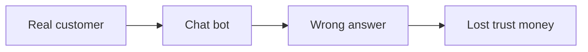
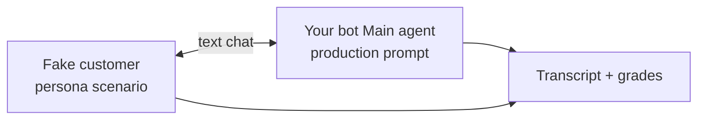
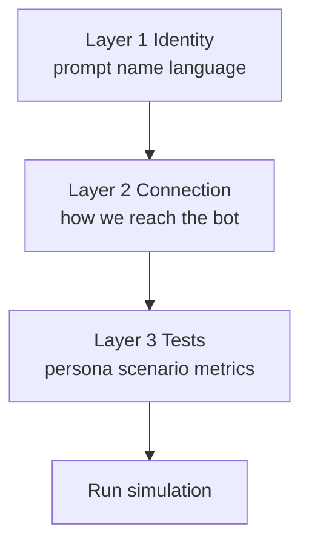
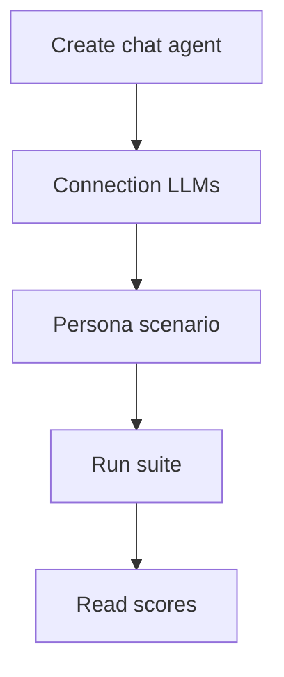
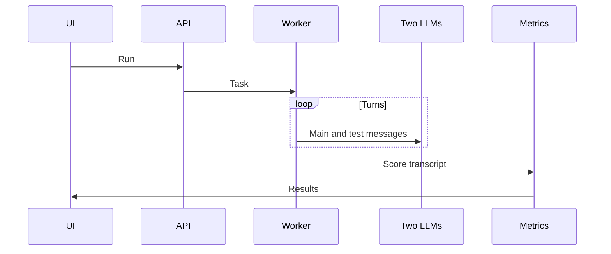

# LLM chat evals — simple diagrams (paste into Excalidraw → Mermaid)

## WHY

Pre-prod testing tries to catch `Bad` before `User` sees it.

## WHAT

## Three layers (connection → agent → eval)

## Your 5 steps

## Tech on Run

