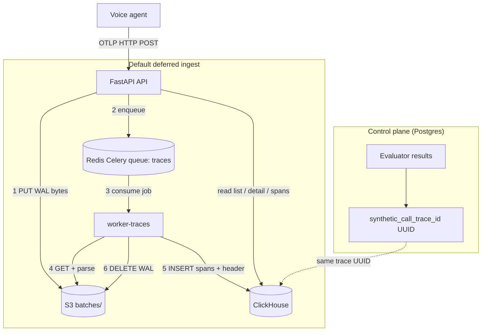
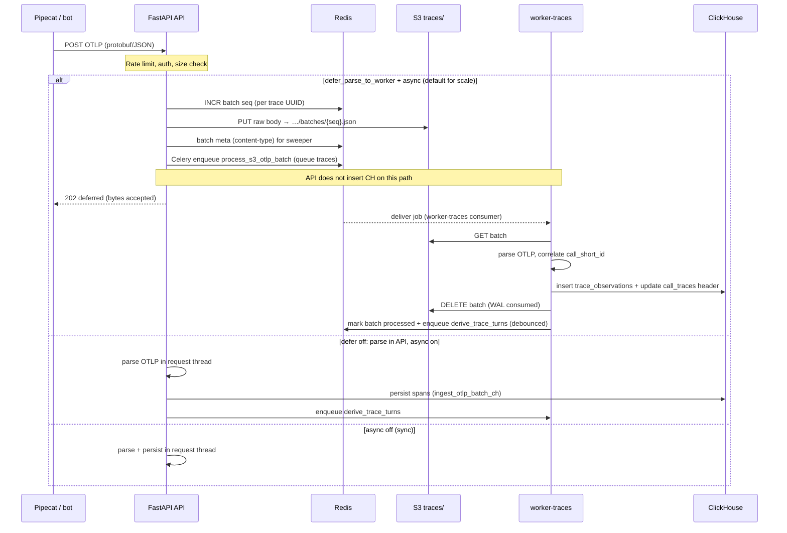

# OTEL traces — team sync (end-to-end)

**Status:** **Not shipped to production yet** — work lives on branch `otel-traces` (local/staging only until we cut a release and run the deploy below).

**Branch:** `otel-traces`

**Goal (when we ship):** Production-scale **call observability** for voice agents (Pipecat, LiveKit, custom OTLP). Bots emit **OTLP spans** during a call; we ingest, store, derive turns/latency, and show **waterfall + transcript** in the UI. Trace headers and spans live in **ClickHouse**; **Postgres** stays the control plane (orgs, evaluators, `evaluator_results.synthetic_call_trace_id` as an opaque UUID link).

---

## 1. What's on the branch (not in prod yet)

| Area | What the branch adds |
|------|----------------|
| **Ingest** | HTTP OTLP (protobuf/JSON); optional async path: S3 WAL → Celery → ClickHouse |
| **Storage** | ClickHouse for trace list/detail/spans; S3 under `traces/organizations/...` for batches and archived spans |
| **Workers** | Queue **`traces`** — **mandatory** for default ingest: Docker **`worker-traces`** or **`[WORKER-TRACES]`** from **`eai start-all`** (always spawned; no `--no-traces-worker`) |
| **Runtime wiring** | Playground + voice WebSocket: `call_short_id`, in-process OTLP export, link/close trace session |
| **UI** | **Calls** hub (`/observability/calls`): list, detail, waterfall, span-based transcript |
| **SDK** | `efficientai[otel]` — session API + OTLP export (`src/efficientai/integrations/efficientai_traces/`) |
| **Evaluators** | Trace linked to evaluator results; OTEL correlation API |
| **Ops** | Readiness checks ClickHouse when `clickhouse.url` is set; CH schema bootstrapped on API startup |
| **Migrations** | `078` / `084` / `085` trace-related PG (legacy); **`092` drops PG trace tables** → CH required for traces in prod |

---

## 2. Mental model: two planes

### HTTP vs “ingest complete”

Bots only speak **HTTP** to the **API**. They never call **`worker-traces`**.

On the **default** path (`defer_parse_to_worker` + `async_ingest_enabled`):

| Step | Component | What happens |
|------|-----------|----------------|
| Accept | **API** | Auth, rate limit, validate body |
| Buffer | **API → S3** | PUT raw OTLP bytes to `…/batches/{seq}.json` (**WAL only** — not parsed, not in ClickHouse yet) |
| Schedule | **API → Redis** | Celery job `process_s3_otlp_batch` on queue **`traces`** |
| Respond | **API → bot** | **202** deferred |
| **Complete ingest** | **`worker-traces` only** | GET S3 → parse OTLP → **INSERT ClickHouse** → DELETE S3 batch → derive turns |

So **API → S3** in diagrams means **write-ahead log**, not “spans are stored.” **ClickHouse writes for OTLP ingest happen only in `worker-traces`** on that path.

The API **does** talk to ClickHouse for **reads** (list trace, detail, spans) and on **non-defer** ingest modes (see §3 matrix).



Ingest order: **Bot → API → S3 (buffer) → Redis (job) → worker-traces → ClickHouse**. See **§3**.

- **Postgres:** evaluator runs, recording metadata, foreign keys — not span payloads at scale.
- **ClickHouse + S3:** high-volume spans, aggregations, list/filter traces, waterfall queries.
- **After migration 092:** if CH is not configured and PG trace tables are gone, trace APIs **fail fast** with a clear error.

---

## 3. Ingest: API is the HTTP edge; worker-traces finishes ingest

**Short answer:**

- **HTTP** always lands on the **API** only (`worker-traces` has no public OTLP port).
- On the **recommended** path, the API **does not parse OTLP or insert spans into ClickHouse**. It **PUTs** the raw body to S3 and **enqueues** `process_s3_otlp_batch`.
- **`worker-traces`** is what **parses OTLP and writes ClickHouse** (and deletes the S3 WAL batch).

Misread to avoid: **API → S3** is not “ingest bypassing the worker” — it is **staging** until the worker runs.



### Which path runs? (`config.yml` → `traces.*`)

| `defer_parse_to_worker` | `async_ingest_enabled` | `clickhouse.url` | What happens on ingest |
|---------------------------|------------------------|------------------|-------------------------|
| **true** (recommended) | **true** | **required** | API → **S3** → enqueue **`process_s3_otlp_batch`** → worker → CH. Returns **deferred** (202). |
| false | true | set | API **parses** OTLP, writes spans to **CH** in the API process, enqueues **derive** on worker. |
| * | false | CH or legacy PG* | API **parses and completes ingest synchronously** in the request (higher API latency). |

\*After migration **092**, legacy PG span storage is gone; **CH is required** for traces.

### What is **not** the default path

- **Staged ingest** (`SyntheticTraceIngestStaging` + `process_staged_otlp`): alternate/async helper path; same idea — persist payload, worker processes later.
- **S3 orphan sweeper** (`sweep_orphan_s3_batches`): safety net if Celery enqueue failed after S3 PUT; re-drives **`process_s3_otlp_batch`**.

---

## 4. Each component: exact job and what breaks without it

### FastAPI API

| Does | Without it |
|------|------------|
| OTLP HTTP ingest, trace list/detail/spans APIs, session open/close, links trace UUID on evaluator rows in Postgres | No ingest, no trace UI data, no session minting |
| On deferred ingest: **S3 PUT + Celery enqueue** (does **not** wait for worker) | N/A |
| Read path: query **ClickHouse** for traces/spans | Empty or error responses for trace views |
| `ensure_schema()` on startup when CH configured | CH tables may be missing → worker/API writes fail |

### `worker-traces` (Celery queue **`traces`**)

| Task | Does | Without worker-traces |
|------|------|------------------------|
| **`process_s3_otlp_batch`** | Download WAL from S3 → parse OTLP → correlate → **insert spans into CH** → delete S3 object → mark batch processed in Redis. **Fails/retry** if 0 rows persisted. | Ingest returns **202** but **UI empty**: batches pile up in S3, no spans in CH |
| **`derive_trace_turns`** | Recompute turns, latency percentiles, component aggregates from spans | Waterfall may show raw spans but **transcript / latency summary stale or missing** |
| **`process_staged_otlp`** | Process rows in ingest staging table (if that path is used) | Staged ingests stuck **pending** |
| **`close_and_offload_trace`** | Close session, derive final metrics, optional **spans.json** archive to S3 | Traces stuck **open**; offload to S3 may not run |
| **`sweep_idle_traces`** | Close traces idle longer than `idle_close_seconds` | Long-running **open** traces, delayed final metrics |
| **`sweep_orphan_s3_batches`** | Re-process S3 batches that never got a worker job | Rare edge case: S3 has data, CH never updated after enqueue failure |

**Important:** Other Celery workers (`usage`, etc.) **do not** consume the `traces` queue. Running API alone is **not** enough for deferred ingest.

### ClickHouse

| Does | Without it (with `clickhouse.url` expected) |
|------|---------------------------------------------|
| Trace headers (list filters), span observations, batch dedupe metadata | **Readiness 503**; deferred ingest **503** (“ClickHouse required”); list/detail/spans APIs broken |
| After PG migration **092** | No fallback span store in Postgres |

### S3 (`traces.s3_prefix`, e.g. `traces/`)

| Object | Lifetime | Purpose |
|--------|----------|---------|
| `…/traces/{trace_uuid}/batches/{seq}.json` | **Seconds** (while worker lags) | Durable WAL between API accept and CH insert; **deleted after successful worker parse** |
| `…/traces/{trace_uuid}/spans.json` | **Long-term** | Compact archive written on **close** from ClickHouse spans; leftover `batches/` prefix deleted on close |

| Does | Without it |
|------|------------|
| WAL + archive | Deferred ingest **fails** at PUT; no buffer if worker is slow |

**Healthy path (what you see in the bucket):** often **no `batches/` during a live call** (worker keeps up). After hangup: **`spans.json` only** under that trace prefix.

### Redis

| Does | Without it |
|------|------------|
| Celery **broker** (deliver jobs to `worker-traces`) | Enqueue fails → ingest **503** after S3 PUT may be inconsistent; use orphan sweeper |
| Batch **sequence** per trace UUID (ordering WAL files) | Deferred ingest **503** (“Redis unavailable for batch sequence”) |
| Ingest **rate limits**, trace header locks, **live turns** cache TTL | Rate limits may fail open/closed depending on code path; live UI updates degraded |

### Postgres

| Does | Without it |
|------|------------|
| Evaluator results, `synthetic_call_trace_id`, call recordings, org/workspace | App down; cannot correlate evaluator UI to trace UUID |
| Does **not** store span payloads at scale (post-092) | — |

**Calls → Traces tab (read path):** With ClickHouse configured, **`GET /observability/traces`** and trace detail/spans are served from **ClickHouse** (and **Redis** for live turns on open calls). Postgres is **not** queried for trace rows or span bodies on that path. Postgres is still used on the same request for **auth** (API key / user → org) and **workspace** resolution (`X-Workspace-Id`, RBAC). Trace headers in CH may carry `evaluator_result_id` / `agent_id` copied at ingest time — those IDs point at Postgres rows when you open evaluator or agent UI, but the list itself is CH-only.

### Celery beat (optional)

| Does | Without it |
|------|------------|
| Scheduled **`sweep_idle_traces`**, **`sweep_orphan_s3_batches`**, staging sweeps | Idle close and orphan recovery only if you trigger tasks manually or rely on session-close paths |

### Frontend

| Does | Without it |
|------|------------|
| Renders trace list, waterfall, transcript from API | Users only see data via raw API / no OTEL UI |

---

## 5. End-to-end: what happens on a call

### A. Phone / evaluator call (Vobiz, etc.)

1. Evaluator run creates **`evaluator_result`** + **`call_recording`** with **`call_short_id`**.
2. **`open_trace`** / **`open_trace_for_call_recording`** opens a trace session in **ClickHouse** (when `clickhouse.url` is set).
3. Bot sends OTLP to **`POST /api/v1/observability/traces`** — see **§3** (API → S3 → worker → CH by default).
4. On idle / hang-up: **close** path enqueues **derive** / **offload** on **`worker-traces`**.
5. UI reads trace by **`call_short_id`** or trace UUID from **CH via API**.

### B. Playground / voice agent WebSocket

1. Client uses **`call_short_id`**; **`build_pipeline_tracing_kwargs`** exports OTLP to the same ingest URL.
2. **`open_trace_session`** / **`close_trace_session`**; optional **`link_trace_to_evaluator_result`**.
3. Same ingest pipeline as §3.

### C. User in the product

1. **Observability → Calls** (`/observability/calls`).
2. Trace detail: waterfall, spans, transcript (derived after **`derive_trace_turns`**).
3. Evaluator result → OTEL correlation / trace drawer.
4. Data Sources: `traces/...` prefix alongside legacy `audio/...` where configured.

---

## 6. Layer-by-layer: code map

### Frontend (React + Vite)

| Piece | Role |
|-------|------|
| Routes | `/observability/calls`, call detail, redirects from `/calls/:traceId` |
| `lib/api.ts` | Trace list/detail/spans, session create/close, setup endpoint, observability calls |
| Trace UI | Waterfall, span transcript (`traceUtils`), Pipecat OTLP setup wizard |

### API (FastAPI)

| Module / route prefix | Role |
|------------------------|------|
| `synthetic_traces.py` → `/observability/traces` | OTLP ingest (sync/async), sessions, list/read spans, staging status, setup info |
| `observability.py` | Call-centric observability (recordings, live events, audio proxy) |
| `playground.py` / `voice_agent.py` | Trace session lifecycle + tracing kwargs on WS |
| `evaluator_results.py` | OTEL correlation, trace cleanup on delete, overview filters |

### Services (Python)

| Component | Path (conceptually) | Role |
|-----------|---------------------|------|
| OTLP parse | `otlp_ingest.py`, `otlp_mapper.py` | Decode protobuf/JSON; map Pipecat spans → turns, latency, correlation |
| Ingest pipeline | `ingest_pipeline.py` | Stage, S3 WAL, enqueue workers, CH ingest |
| Trace lifecycle | `trace_service.py`, `ch_trace_ops.py` | Open/close/list/detail; CH when enabled |
| CH store | `clickhouse_store.py`, `ch_trace_ops.py` | Queries, inserts, schema |
| Span storage | `span_storage.py`, S3 sweeper | Batches, orphan sweep (`s3_batch_orphan_minutes`) |
| Playground tracing | `playground_tracing.py`, `internal_otlp_exporter.py` | In-process export to our ingest URL |
| Health | `health.py` | Readiness: migrations + **ClickHouse ping** when `clickhouse.url` is set |

### Workers (Celery)

See **§4** for each task and failure mode. Queue **`traces`** only on a dedicated consumer (see **§6b**).

### 6b. Runtime topologies (do not double-consume)

| How you run | Traces worker | Infra |
|-------------|---------------|--------|
| **Local dev (common)** | `eai start-all` spawns **`[WORKER-TRACES]`** subprocess (always on; not optional). Does **not** start Docker `worker-traces`. | `docker compose up -d db redis clickhouse` + `start-all` on host |
| **Full Docker Compose** | Service **`worker-traces`** (`eai worker … -Q traces`). API service uses **`eai start`** only — **no** embedded traces worker. | `app` + `worker-traces` + `beat` + … |
| **Production** | Scale **N replicas** of traces worker; same Redis broker + S3 + CH as API | LB → API pods; HPA on `worker-traces` |

`start-all` sets **`EFFICIENTAI_CONFIG_PATH`** so Celery children load the same `config.yml` as `--config`.

**Celery Beat** (idle close, orphan S3 sweep every 15m) runs in `start-all` by default; schedules tasks on queue **`traces`** — still needs a traces consumer.

---

## 7. Configuration

From `config.yml.example` (production `config.yml` should mirror this):

```yaml
traces:
  async_ingest_enabled: true
  defer_parse_to_worker: true
  s3_prefix: "traces/"
  s3_batch_orphan_minutes: 15
  idle_close_seconds: 120
  # rate limits, body size, staging retention, etc.

clickhouse:
  url: "https://clickhouse.your-domain:8123"
  database: "efficientai"
  user: "..."
  password: "..."
```

**API startup:** if `clickhouse.url` is set → `ensure_schema()` creates/updates CH tables.

**Readiness:** with CH configured, **unhealthy ClickHouse = 503** on readiness (do not route traffic).

---

## 8. Planned production deployment (after release)

Use this when we **first ship** OTEL traces — not applicable until `otel-traces` is merged/released and infra is ready.

### Prerequisites

1. **ClickHouse** reachable from API and **`worker-traces`**.
2. **S3** (or compatible blob store) with `traces.s3_prefix` (default `traces/`).
3. **Redis** for Celery and trace-side caching / rate limits.

### Deploy steps

1. Run Postgres migrations: **078**, **084**, **085**, then **092** (drops PG `synthetic_call_traces` and payload tables — **run only when CH is ready**).
2. Deploy **API** with `clickhouse.url` and `traces.*` configured.
3. Deploy **frontend** (trace UI routes).
4. Deploy / scale **`worker-traces`** (queue **`traces`**).
5. Optional: Celery **beat** for scheduled idle sweep / S3 orphan tasks (confirm beat schedule in your env).

### Smoke tests

- [ ] Readiness: migrations up, ClickHouse `ok`
- [ ] Pipecat bot → OTLP POST → **202** (async) or success (sync)
- [ ] `worker-traces` consumes queue; CH has rows for test org/workspace
- [ ] UI: list traces, open waterfall + transcript
- [ ] Playground call with `call_short_id` → trace linked on evaluator result

### Rollback note

After **092**, rolling back trace **code** without CH is not viable. Keep CH up or use a deliberate migration rollback (not recommended). Prefer fix-forward on CH/workers.

---

## 9. Scaling mental model (thousands of calls)

| Tier | Concurrent OTLP calls (order of magnitude) | Topology |
|------|---------------------------------------------|----------|
| Local / pilot | 1–20 | `start-all` + single CH container |
| Production tenant | 20–100+ | Multiple API pods + **multiple `worker-traces`** + managed CH + S3 |
| High volume | 500+ | Same + CH sizing, rate limits, Phase 3 rollups/collector (see architecture.mdx) |

**Design properties that scale:** API O(1) per batch (S3 PUT + enqueue); S3 WAL not held for whole call; CH partitioned observations; `call_short_id` correlation independent of OTel `trace_id`.

**Not scalable as a single process:** one laptop `start-all` for thousands of **concurrent** calls — scale **workers and CH**, not the dev entrypoint.

---

## 10. On the branch today vs what prod will need at ship time

| Implemented on `otel-traces` | Must be in place when we go live |
|------------------------------|----------------------------------|
| OTLP ingest + UI + evaluator linking | `clickhouse.url` set |
| Async S3 WAL path | S3 enabled + `traces.s3_prefix` |
| Background processing | **`worker-traces`** running |
| Rate limiting / live turns | Redis |

---

## 11. Further reading in-repo

| Doc | Topic |
|-----|--------|
| `docs/call-traces-scaling-tdd-confluence.md` | **v2.0** — Confluence TDD: E2E architecture, DevOps service map, bottlenecks (CH/S3 WAL) |
| `docs/call-traces-storage-decision-tdd-confluence.md` | S3-first ingest decision |
| `docs-fumadocs/content/docs/monitoring/call-traces/architecture.mdx` | S3 WAL + ClickHouse architecture |
| `docker-compose.yml` | `clickhouse`, `worker-traces` services |
| `config.yml.example` | `traces`, `clickhouse` |

---

## 12. Key API surface (quick reference)

| Endpoint area | Purpose |
|---------------|---------|
| `POST /api/v1/observability/traces/ingest` (and OTLP variants) | Ingest spans |
| `GET /api/v1/observability/traces` | List traces |
| `GET /api/v1/observability/traces/{id}` | Trace detail |
| `GET /api/v1/observability/traces/{id}/spans` | Span payload for waterfall |
| Session create/close | Mint `call_short_id`, close idle sessions |
| `GET /api/v1/evaluator-results/{id}/otel-correlation` | Link evaluator UI to trace |

---

*OTEL traces scope only. **Pre-release:** update this doc and pin a commit SHA when we actually deploy to production.*
