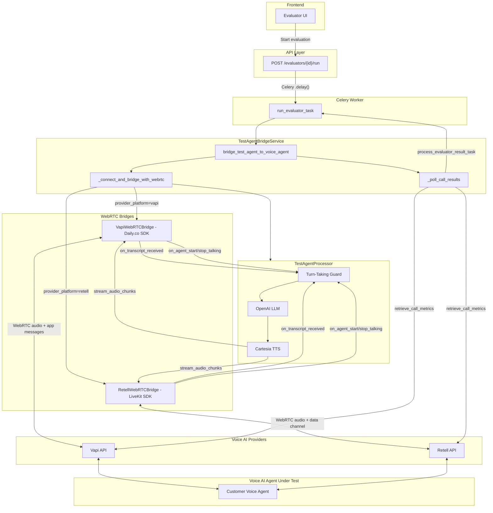
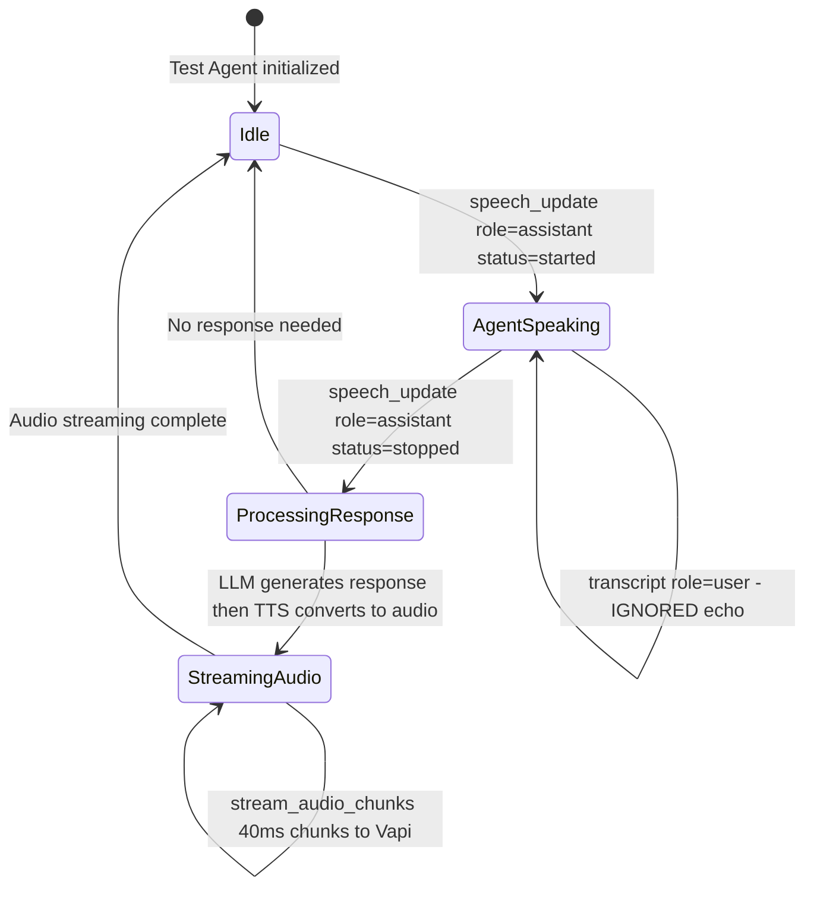
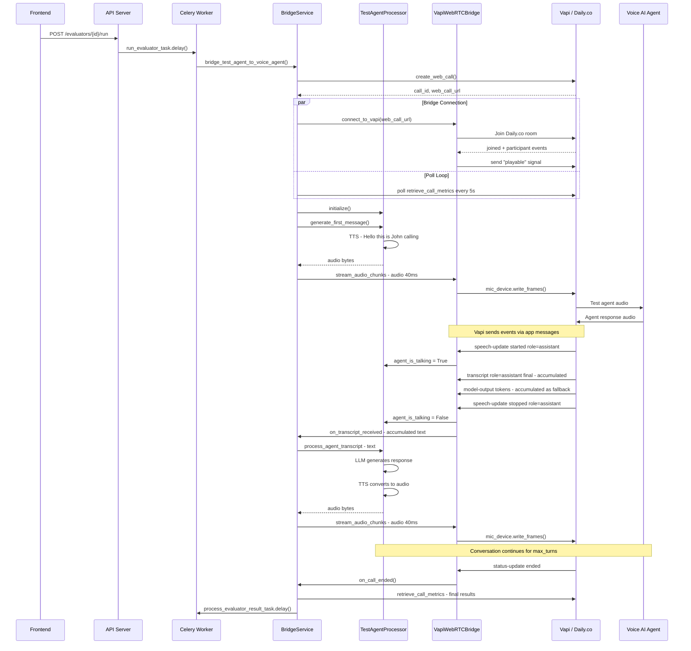

# Test Agent Bridge — Architecture & Technical Design Document

## 1. Overview

The Test Agent Bridge is a system that enables automated evaluation of Voice AI agents (hosted on Vapi or Retell) by simulating a realistic caller. A **Test Agent** — powered by an LLM (OpenAI) and TTS (Cartesia) — connects to the customer's Voice AI agent over WebRTC, conducts a multi-turn voice conversation based on a configured persona and scenario, and captures the results for evaluation.

---

## 2. Architecture Diagram



---

## 3. Turn-Taking State Machine (Vapi)



**Key behaviors during each state:**

| State | Incoming Transcript Handling |
|-------|----------------------------|
| **Idle** | Processed immediately via `process_agent_transcript` |
| **AgentSpeaking** | Queued in `_pending_transcript` (not processed) |
| **ProcessingResponse** | Queued in `_pending_transcript` (not dropped) |
| **StreamingAudio** | Queued in `_pending_transcript` (not dropped) |

---

## 4. Sequence Diagram (Happy Path)



---

## 5. Goals

- Automate end-to-end voice evaluation without requiring a human caller.
- Support multiple Voice AI platforms (Vapi, Retell) through a unified bridge abstraction.
- Implement proper turn-taking to ensure natural conversational flow (no overlapping speech).
- Capture call recordings, transcripts, and metrics for downstream quality evaluation.

## 6. Non-Goals

- Real-time human-in-the-loop supervision during evaluation calls.
- Supporting non-WebRTC voice providers (e.g., SIP/PSTN-only integrations).

---

## 7. System Components

| Component | File | Responsibility |
|-----------|------|----------------|
| **Celery Worker** | `app/workers/celery_app.py` | Entry point; dispatches `run_evaluator_task` |
| **TestAgentBridgeService** | `app/services/test_agent_bridge_service.py` | Orchestrates the full evaluation lifecycle |
| **VapiWebRTCBridge** | `app/services/webrtc_bridge/vapi_webrtc_bridge.py` | WebRTC connection to Vapi via Daily.co SDK |
| **RetellWebRTCBridge** | `app/services/webrtc_bridge/retell_webrtc_bridge.py` | WebRTC connection to Retell via LiveKit SDK |
| **TestAgentProcessor** | `app/services/webrtc_bridge/test_agent_processor.py` | LLM + TTS pipeline with turn-taking logic |
| **Voice Providers** | `app/services/voice_providers/vapi.py`, `retell.py` | API clients for creating calls and fetching results |

---

## 8. Data Flow

### 8.1 Evaluation Trigger

```
Frontend → POST /evaluators/{id}/run → Celery task → BridgeService
```

### 8.2 Call Lifecycle

```
BridgeService → Provider.create_web_call() → WebRTC Bridge connects
→ TestAgent sends first message → Conversation loop → Call ends
→ Poll for results → Store metrics → Trigger quality evaluation
```

### 8.3 Audio Flow (Per Turn)

```
TestAgent.process_agent_transcript(text)
  → OpenAI LLM → response text
  → Cartesia TTS → PCM audio bytes
  → stream_audio_chunks(audio, chunk_callback, 40ms)
  → WebRTCBridge.receive_audio_from_test_agent(chunk)
  → Provider mic device (Daily mic_device / LiveKit AudioSource)
```

---

## 9. Turn-Taking Design

Turn-taking is the most critical aspect of the bridge. The system must avoid the test agent talking over the Voice AI agent.

### 9.1 Problem (Pre-Fix)

The original Vapi bridge had a feedback loop:

1. Test agent sends audio to Vapi.
2. Vapi's STT transcribes the test agent's speech and sends back `transcript` events with `role: "user"`.
3. The bridge forwarded ALL transcripts (regardless of role) to `process_agent_transcript`.
4. The test agent responded to its own echoed speech, creating an infinite loop of self-responses.

Additionally, `speech-update` and `model-output` events from Vapi were unhandled, meaning the bridge had no awareness of when the Vapi agent was speaking.

### 9.2 Solution

The fix models Retell's turn-taking approach:

**Transcript Filtering (VapiWebRTCBridge):**

- `role: "user"` transcripts are **ignored** (test agent's own speech echo).
- `role: "assistant"` with `transcriptType: "final"` are **accumulated** (Vapi sends one final per sentence).
- `model-output` tokens are accumulated as a **fallback** transcript source.

**Speech State Tracking (VapiWebRTCBridge):**

- `speech-update` with `role: "assistant"`, `status: "started"` sets `_agent_is_talking = True`.
- `speech-update` with `role: "assistant"`, `status: "stopped"` sets `_agent_is_talking = False`, fires `on_agent_stop_talking`, then delivers the accumulated transcript.

**Turn Guards (TestAgentProcessor):**

- If `agent_is_talking == True`, incoming transcripts are queued in `_pending_transcript`.
- If `is_processing == True`, incoming transcripts are queued (not dropped).
- After processing completes, any pending transcript is automatically picked up.
- The `on_agent_stop_talking` callback also checks for pending transcripts as a safety net.

**Event Ordering:**

- `on_agent_stop_talking` is scheduled BEFORE transcript delivery via `_run_async` (FIFO order in the event loop), ensuring `agent_is_talking = False` before the transcript reaches `process_agent_transcript`.

### 9.3 Comparison: Vapi vs Retell Turn-Taking

| Aspect | Retell | Vapi |
|--------|--------|------|
| WebRTC SDK | LiveKit | Daily.co |
| Sample Rate | 24000 Hz | 16000 Hz |
| Chunk Duration | 20ms | 40ms |
| Agent Start/Stop | Explicit `agent_start_talking` / `agent_stop_talking` events | `speech-update` with `status` + `role` fields |
| Transcript Delivery | Accumulated during `update` events; delivered on `agent_stop_talking` | Multiple `transcriptType: "final"` events accumulated; delivered on `speech-update stopped` |
| User Echo Filtering | N/A (Retell doesn't echo user transcripts) | `role: "user"` transcripts ignored |
| Fallback Transcript | N/A | `model-output` token accumulation |

---

## 10. Key Configuration

| Parameter | Value | Description |
|-----------|-------|-------------|
| `max_turns` | 20 | Maximum conversation turns before auto-ending |
| `response_delay_ms` | 500 | Artificial delay before responding (natural pacing) |
| `llm_model` | gpt-4o-mini | LLM model for response generation |
| `tts_provider` | cartesia | TTS provider for speech synthesis |
| `call_timeout` | 300s | Max call duration (5 min) |
| `poll_interval` | 5s | Polling interval for call results |
| `poll_max_attempts` | 120 | Max poll attempts (~10 min) |

---

## 11. Error Handling & Resilience

| Mechanism | Description |
|-----------|-------------|
| **Celery retry** | `run_evaluator_task` retries up to 3 times with 60s backoff on failure |
| **Call timeout** | Bridge disconnects after 300s to prevent runaway calls |
| **Transcript fallback** | If no `role: assistant` transcripts arrive, `model-output` token accumulation provides the agent's response |
| **Pending transcript queue** | Transcripts arriving during processing or agent speech are queued (not dropped) and processed automatically |
| **Graceful disconnection** | On call end, recording is saved, bridge disconnects, and polling continues until provider returns final metrics |

---

## 12. Future Considerations

- **Additional Voice Providers**: The bridge architecture supports adding new providers by implementing a new WebRTC bridge class and a corresponding voice provider client.
- **STT/TTS Provider Extensibility**: The `STT_PROVIDERS` and `TTS_PROVIDERS` registries in `voice_bundle.py` allow adding new providers via configuration.
- **Streaming TTS**: Currently the full TTS audio is generated before streaming. A streaming TTS approach could reduce first-byte latency.
- **Parallel Evaluations**: Multiple evaluations can run concurrently via Celery worker pool scaling.
